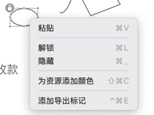

[toc]

### 1. 锁定对象

选择对象后，使用快捷键 <kbd>Command</kbd> + <kbd>L</kbd>（Mac OS）或 <kbd>Ctrl</kbd> + <kbd>L</kbd>（Windows）可将对象进行锁定，在选择锁定的对象时，对象的左上角会出现一个 “锁定” 图标。

### 2. 解锁对象

对象锁定后，再次使用快捷键 <kbd>Command</kbd> + <kbd>L</kbd>（Mac OS）或 <kbd>Ctrl</kbd> + <kbd>L</kbd>（Windows），或单击锁定对象左上角的 “锁定” 图标，可以解锁以锁定的对象。

### 3. 使用鼠标锁定或解锁对象

选中对象后单击鼠标右键，选择 “锁定” 或 “解锁”，也可以锁定或解锁对象。

### 4. 使用菜单锁定或解锁对象

在 Mac OS 系统中，用户在菜单中的 “对象” 子菜单中找到 “锁定” 或 “解锁”，可以锁定或解锁对象。

>   注意
>
>   锁定的对象可以被选中但是无法移动或编辑。

