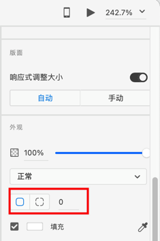
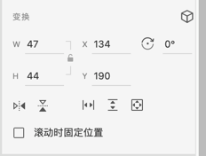

[toc]

### 1. 通过矩形工具绘制圆角矩形

选中左侧工具栏中的 "矩形" 工具（或按快捷键 <kbd>R</kbd>），绘制完成的矩形或正方形上有 8 个空心圆圈和 4 个内有圆点的圆圈。

将鼠标指针放在顶部、右侧、底部及左侧中间的这 4 个位置的空心圆圈上，然后安装鼠标左键不放并拖动鼠标指针可以修改形状的大小。拖住鼠标指针时按住 <kbd>Shift</kbd> 键，可以锁定宽高比并以等比例形式缩放图形。

4 个内有圆点的圆圈属于 "半径编辑" 手柄，在任意一个 "半径编辑" 手柄上按住鼠标左键不放并将手柄向矩形的中心拖动，可以同时修改矩形 4 个角的圆角大小，制作出圆角矩形。

### 2. 通过修改矩形属性绘制圆角矩形

选中左侧工具栏中的 "矩形" 工具（或按快捷键 <kbd>R</kbd>），绘制一个矩形，然后再属性检查其中修改矩形的 "圆角" 属性。

在上图中，选中第一矩形，在后面的数字输入框中输出圆角半径可以同时修改矩形四个角的圆角半径。选中第二矩形，可以分别设置矩形四个角的圆角半径。

### 3. 通过修改矩形属性修改矩形尺寸

可以通过属性检查器修改已存在的矩形的尺寸和位置。

