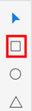

[toc]

### 1. 以对角线绘制矩形

选中左侧工具栏中的 "矩形" 工具（或按快捷键 <kbd>R</kbd>），此时鼠标指针变为 "十字右下角有一个小矩形" 的状态，在画板中按住鼠标左键不放，即可以拖动的距离为对角线绘制一个矩形。

### 2. 以中心点绘制矩形

选中左侧工具栏中的 "矩形" 工具（或按快捷键 <kbd>R</kbd>），按住 <kbd>Option</kbd> 键（Mac OS）或 <kbd>Alt</kbd> 键（Windows）可以从鼠标指针落点的地方为中心开始绘制矩形。

### 3. 绘制正方形

选中左侧工具栏中的 "矩形" 工具（或按快捷键 <kbd>R</kbd>），在拖动鼠标指针的同时，按住 <kbd>Shift</kbd> 键，即可以拖动的距离为对角线绘制一个正方形。

