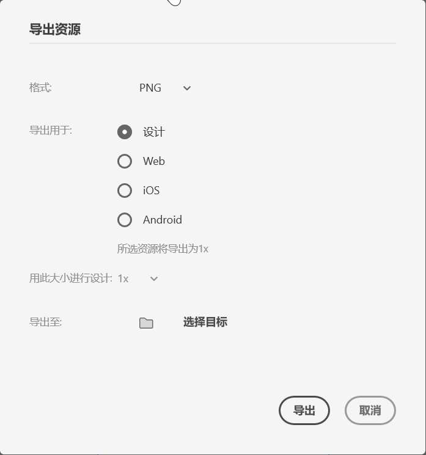

[toc]

常见导出方式有3 种：`批处理...`、`所选内容...`、`所有画板...` 和 `After Effects...`。

### 1. 批处理

功能暂时不知道

### 2. 所选内容

选择要导出的内容，然后点击菜单 `文件` -> `导出` -> `所选内容...`，也可以按 <kbd>Ctrl</kbd> + <kbd>E</kbd> 快捷键。应用将会弹出 `导出资源` 对话框，用户可以选择导出的格、用途、设计分辨率和文件夹位置。

### 3. 所有画板

点击菜单 `文件` -> `导出` -> `所有画板...`。应用将会弹出 `导出资源` 对话框，用户可以选择导出的格、用途、设计分辨率和文件夹位置。

### 4. After Effects

选择要导出的画板，然后点击菜单 `文件` -> `导出` -> `After Effects...`，也可以按 <kbd>Ctrl</kbd> + <kbd>Alt</kbd> + <kbd>F</kbd> 快捷键，将会将选中的画板导出导到 AE 软件中。

