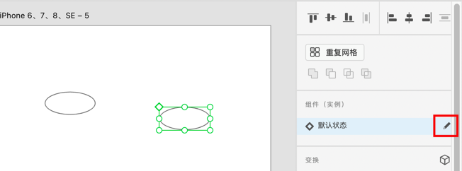
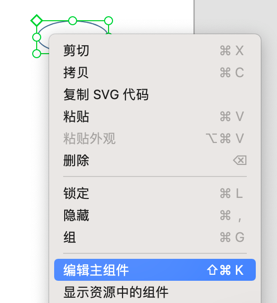
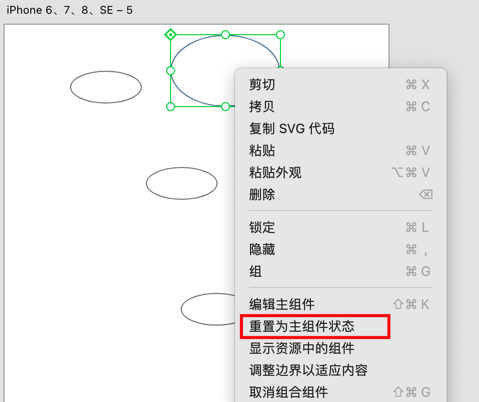

[toc]

### 1. 同时调整所有使用统一组件创建的对象

在画板中双击任何一个组件的实例，可以修改组件内容。

>   注意
>
>   +   只能通过调整元素组件对象（即该组件的来源对象）来达到同步调整所有对象的要求。
>
>   +   如果用于创建组件的原始对象不存在，是无法按照上面的操作调整对象的。
>
>   +   如果组件原始对象不存在，可以在选择任何一个组件创建的对象，在属性检查表中点击默认状态后面的添加图标，来添加默认的组件（画板上或外面会自动创建一个默认状态的对象）。
>
>       
>
>       或者通过右键单击，选择 “编辑主组件” 菜单来添加默认主组件对象。
>
>       
>
>   +   如果在添加默认的组件前，其他对象的状态已经改变，在调整默认对象时，是无法同步调整该对象的。可以通过点击鼠标右键，在弹出的菜单中选择 "重置为组件状态"。这时再调整默认对象，该对象也会同步改变。
>
>       

### 2. 调整单个组件创建的对象

需要对单个组件实例进行修改而不同步到其他实例，可以使用快捷键 <kbd>Command</kbd> + <kbd>Shift</kbd> + <kbd>G</kbd>（Mac OS）或 <kbd>Ctrl</kbd> + <kbd>Shift</kbd> + <kbd>G</kbd>（Windows），或单击鼠标右键，选择 “取消组件编组” 命令，再修改就不会同步了。

### 3. 创建组件实例

从资源面板中拖动组件到画板上，可以创建一个该组件的实例；直接复制实例，也可以创建一个新实例。

### 4. 替换组件

从资源面板中拖动一个组件到画板的另一个组件上可以替换画板上的组件，画板上组件的所有实例都会被替换。