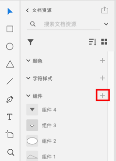

[toc]

### 1. 使用快捷键制作组件

 XD 中的对象都可以转换为组件，选择需要转换为组件的对象后，使用快捷键 <kbd>Command</kbd> + <kbd>K</kbd> （Mac OS）或 <kbd>Ctrl</kbd> + <kbd>K</kbd>（Windows）可以转换为符号。

### 2. 使用鼠标制作组件

选择对象后单击鼠标右键，选择 “制作组件” 选项命令。

### 3. 使用添加组件按钮制作组件

选择对象后在资源面板单击 “组件” 后的 “添加资源” 按钮。

### 4. 使用菜单制作组件

选择对象后，选择 `对象` -> `制作组件` 菜单来将对象转换成组件。