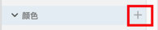
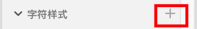

[toc]

### 1. 添加颜色资源

选择任何一个或多个对象，单击资源面板中 “颜色” 右侧的 “添加资源” 按钮，可以将所选对象的填充颜色或渐变、描边颜色添加到资源面板中。

### 2. 添加字符样式资源

选择点文本或区域文本，单击资源面板中 “字符样式” 右侧的 “添加资源” 按钮，可以将字符样式添加到 “资源” 面板中。

### 3. 通过菜单添加颜色和字符样式资源

选择对象后，单击鼠标右键，选择 “为资源添加颜色” 或 “为资源添加字符样式” 选项命令，可以往资源面板中添加资源。

### 4. 通过快捷键添加颜色和字符样式资源

选择画板或者使用快捷 <kbd>Command</kbd> + <kbd>A</kbd>（Mac OS）或 <kbd>Ctrl</kbd> + <kbd>A</kbd> （Windows） 全选 XD 文件中的全部内容，可以将选择对象的颜色和字符样式统一添加到资源面板中。

>   注意
>
>   添加到资源面板中的资源仅存储于当前文件中，删除当前文件中的对象，已添加到 “资源” 面板的颜色、字符样式仍会保留。