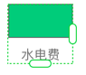

选择一个对象或一组对象，然后单击属性检查中的 ”重复网格“ 按钮  或者使用快捷键 <kbd>Command</kbd> + <kbd>R</kbd>（Mac OS) 或 <kbd>Ctrl</kbd> + <kbd>R</kbd>（Windows) 可以创建重复网格。

按住右侧的 ”重复“ 按钮并向右拖动，元素将在水平方向重复复制。按住底部的 ”重复“ 按钮并在垂直方向下拖动，元素将在垂直方向重复复制。