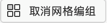

在需要对重复网格中的元素进行单独编辑时，可取消重复网格，操作方式有以下 3 种方式：

+   选中重复网格后，单击属性检查器中的 ”取消网格编组“ 图标 ，可以取消重复网格。
+   选中重复网格后，使用快捷键 <kbd>Command</kbd> + <kbd>Shift</kbd> + <kbd>G</kbd>（Mac OS）或 <kbd>Ctrl</kbd> + <kbd>Shift</kbd> + <kbd>G</kbd>（Windows）可取消重复网格。
+   选中重复网格后，单击鼠标右键，并在弹出的右键菜单中选择 ”取消网格编组“ 选项命令。