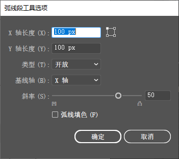
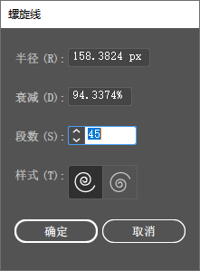
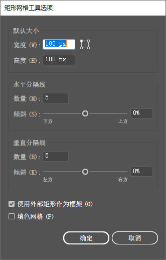

[toc]

### 1. 绘制直线段

直线段工具  用来创建直线。在绘制过程中按住 <kbd>Shift</kbd> 键，可以创建水平、垂直或以 45° 角方向为增量的直线；按住 <kbd>Alt</kbd> 键，直线会以单机点为中心向两侧延伸；如果要创建指定长度和角度的直线，可在画板中单击，打开 ”直线段工具选项“ 对话框进行设置。

### 2. 绘制弧线

弧线工具  用来创建弧线。在绘制过程中按下 <kbd>X</kbd> 键，可以切换弧线的凹凸方向；按 <kbd>C</kbd> 键，可在开放式图形与闭合图形之间切换；按住 <kbd>Shift</kbd> 键，可以保持固定的角度；按下 <kbd>↑</kbd>、<kbd>↓</kbd>、<kbd>←</kbd>、<kbd>→</kbd> 键可以调整弧线的斜率。如果要创建更为精确的弧线，可在画板中单击，打开 "弧线段工具选项" 对话框设置参数。

+ 参考点定位器 ：单击参考点定位器上的空心方块，可设置绘制弧线时的参考点。
+ X 轴长度 / Y 轴长度：用来设置弧线的长度和高度。
+ 类型：选择下拉列表中的 “开放”，可创建开放式弧线；选择 “闭合”，可创建闭合式弧线。
+ 基线轴：选择下拉列表中的 “X 轴”，可以沿水平方向绘制；选择 “Y 轴”，则沿垂直方向绘制。
+ 斜率：用来指定弧线的斜率方向，可输入数值或拖曳滑块来进行调整。
+ 弧线填色：选择该选项后，会用当前的填充颜色为弧线围合的区域填色。

### 3. 绘制螺旋线

螺旋线工具  用来创建螺旋线。选择该工具后，并拖曳鼠标即可绘制螺旋线，在拖曳鼠标的过程中移动光标可以旋转螺旋线；按下 <kbd>R</kbd> 键，可以调整螺旋线的方向；按住 <kbd>Ctrl</kbd> 键可调整螺旋线的紧密度；按下 <kbd>↑</kbd> 键可增加螺旋，按下 <kbd>↓</kbd> 键则减少螺旋。如果要更加精确地绘制图形，可在画板中单击，打开 “螺旋线” 对话框设置参数。

+ 半径：用来设置从中心到螺旋线最外侧的点的距离。该值越高，螺旋的范围越大。
+ 衰减：用来设置螺旋线的每一螺旋相对于上一个螺旋应减少的量。该值越小，螺旋的间距越小。
+ 段数：决定了螺旋线路径段的数量。
+ 样式：可以设置螺旋线的方向。

### 4. 绘制矩形网格

使用矩形网格工具  时，在画板中单击并拖曳鼠标，可以自定义网格大小。如果要使用指定数目的分隔线来创建矩形网格，可以在文件窗口单击，打开 “矩形网格工具选项” 对话框设置参数。

+ 宽度 / 高度：用来设置矩形网格的宽度和高度。
+ 参数点定位器  ：单击参考点定位器  上的空心方块，可以确定绘制网格时的起始点和位置。
+ “水平分隔线” 选项组：“数量”用来设置在网格顶部和底部之间出现的水平分隔线的数量。“倾斜” 值决定了水平分隔线从网格顶部或底部倾向于左侧或右侧的方式。当 ”倾斜“ 值为 0% 时，水平分隔线的间距相同；该值大于 0% 时，网格的间距由上到下逐渐变窄；该值小于 0% 时，网格的间距由下到上逐渐变窄。
+ “垂直分隔线” 选项组：“数量” 用来设置在网格左侧和右侧之间出现的分隔线的数量。“倾斜” 决定了垂直分隔线倾向于左侧或右侧的方式。当 “倾斜” 值为 0% 时，垂直分隔线的间距相同；该值大于 0% 时，网格的间距由左到右逐渐变窄；该值小于 0% 时，网格的间距由右到左逐渐变窄。
+ 使用外部矩形作为框架：选择该项后，将以单独的矩形对象替换顶部、底部、左侧和右侧线段。此时可在矩形的内部填充颜色。
+ 填色网格：选择该选项后，可在网格线上应用描边颜色，但网格内部不会填色。

**技术看板：** 矩形网格创建技巧

使用矩形网格工具  时，按住 <kbd>Shift</kbd> 键可以创建正方形网格；按住 <kbd>Alt</kbd> 键，会以单击点为中心向外绘制网格；按下 <kbd>F</kbd> 键，网格中的水平分隔线间距可由下而上以 10% 的倍数递减；按下 <kbd>V</kbd> 键，水平分隔线的间距可由上而下以 10% 的倍数递减；按下 <kbd>X</kbd> 键，垂直分隔线的间距可由左向右以 10% 的倍数递减；按下 <kbd>C</kbd> 键，垂直分隔线的间距可由右向左以 10% 的倍数递减；按下 <kbd>↑</kbd> 键，可以增加水平分隔线的数量；按下 <kbd>↓</kbd> 键，则减少水平分隔线的数量；按下 <kbd>→</kbd> 键，可以增加垂直分隔线的数量；按下 <kbd>←</kbd> 键，可以减少垂直分隔线的数量。

### 5. 绘制极坐标网格

使用极坐标网格工具  时，在画板中点击并拖曳鼠标，可以自定义网格大小。如果要创建具有指定大小和指定数目分隔线的同心圆，可在文档窗口单击，打开 “极坐标网格工具选项” 对话框进行设置。

+ 宽度 / 高度：用来指定整个网格的宽度和高度。
+ 参考点定位器  ：单击参考点定位器  上的空心方块，可以确定绘制网格时的起点的位置。
+ “同心圆分隔线” 选项组：“数量” 用来设置出现在网格中的圆形同心圆分隔线的数量。“倾斜” 值决定了同心圆分隔线倾向于网格内侧或外侧的方式。当 ”倾斜“ 值为 0%时，同心圆之间的距离相同；该值大于 0% 时，同心圆向边缘聚拢；该值小于 0% 时，同心圆向中心聚拢。
+ “径向分隔线” 选项组：“数量” 用来设置在网格中心和外围之间出现的径向分隔线的数量。“倾斜” 值决定了径向分隔线倾向于网格逆时针或顺时针的方式。当 “倾斜” 值为 0% 时