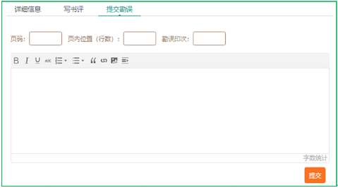

# 服务与支持

本书由异步社区出品，社区（https://www.epubit.com/）为你提供相关资源和后续服务。

## 提交勘误

作者和编辑尽最大努力来确保书中内容的准确性，但难免会存在疏漏。欢迎你将发现的问题反馈给我们，帮助我们提升图书的质量。

当你发现错误时，请登录异步社区，按书名搜索，进入本书页面，单击“提交勘误”，输入勘误信息，单击“提交”按钮即可（见下图）。本书的作者和编辑会对你提交的勘误进行审核，确认并接受后，你将获赠异步社区的100积分。积分可用于在异步社区兑换优惠券、样书或奖品。

## 与我们联系

我们的联系邮箱是contact@epubit.com.cn。

如果你对本书有任何疑问或建议，请你发邮件给我们，并请在邮件标题中注明本书书名，以便我们更高效地做出反馈。

如果你有兴趣出版图书、录制教学视频，或者参与图书翻译、技术审校等工作，可以发邮件给我们；有意出版图书的作者也可以到异步社区在线投稿（直接访问www.epubit.com/contribute即可）。

如果你所在学校、培训机构或企业想批量购买本书或异步社区出版的其他图书，也可以发邮件给我们。

如果你在网上发现有针对异步社区出品图书的各种形式的盗版行为，包括对图书全部或部分内容的非授权传播，请你将怀疑有侵权行为的链接发邮件给我们。你的这一举动是对作者权益的保护，也是我们持续为你提供有价值的内容的动力之源。

## 关于异步社区和异步图书

“异步社区”是人民邮电出版社旗下IT专业图书社区，致力于出版精品IT图书和相关学习产品，为作译者提供优质出版服务。异步社区创办于2015年8月，提供大量精品IT图书和电子书，以及高品质技术文章和视频课程。更多详情请访问异步社区官网https://www.epubit.com。

“异步图书”是由异步社区编辑团队策划出版的精品IT专业图书的品牌，依托于人民邮电出版社近几十年的计算机图书出版积累和专业编辑团队，相关图书在封面上印有异步图书的LOGO。异步图书的出版领域包括软件开发、大数据、人工智能、测试、前端、网络技术等。

<b class="my_markdown">异步社区</b>

<b class="my_markdown">微信服务号</b>

