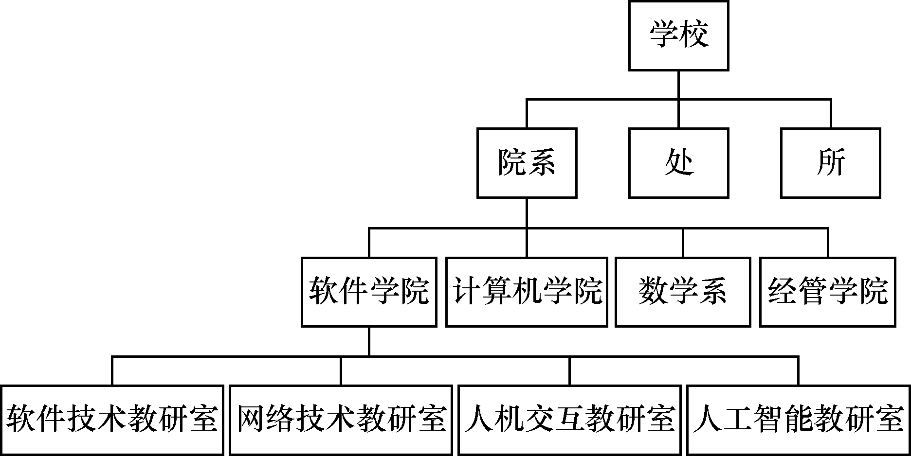
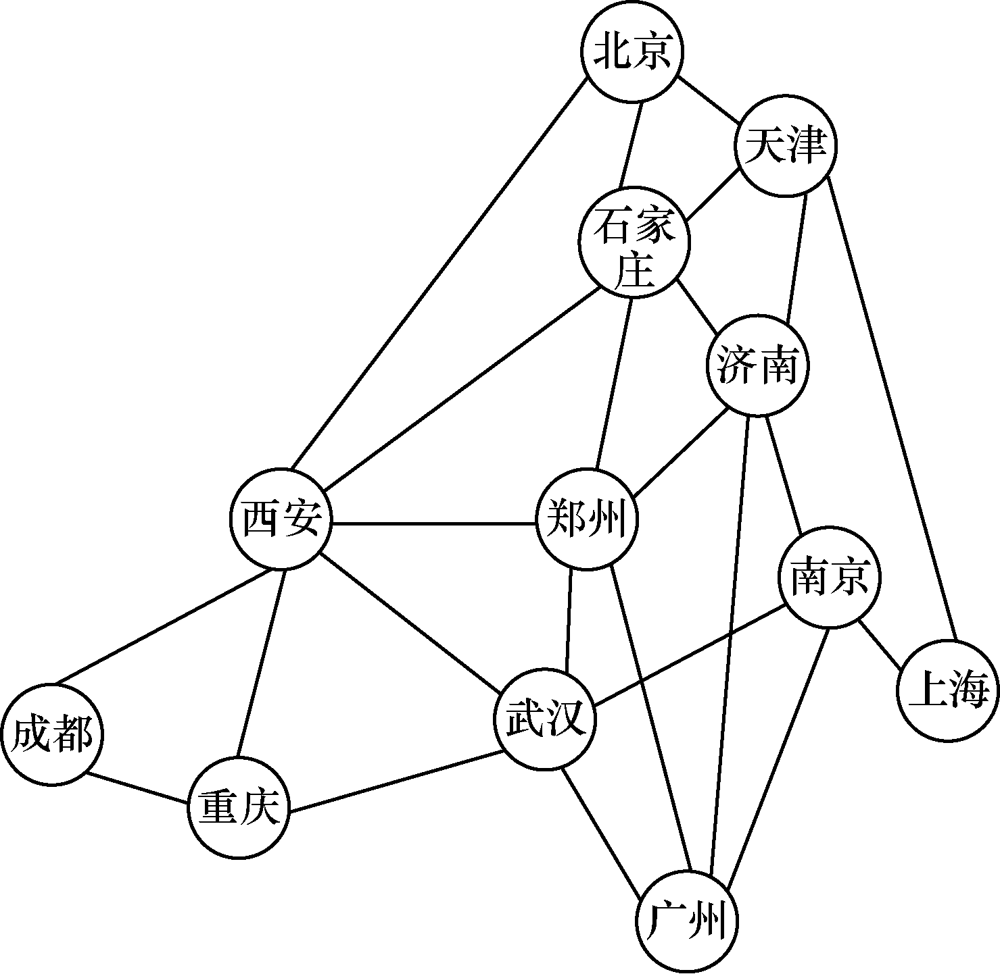

### 0.1　基本概念和术语

本节主要介绍有关数据结构的一些基本概念和术语，以便读者对数据结构有一个初步的认识。

#### 1．数据

**数据** （data）是能被计算机识别并能被输入计算机中进行处理的符号的集合。换言之，数据就是计算机化的信息。早期的计算机主要应用于数值计算，数据量小且结构简单，数据只包括整型、实型和布尔型，仅能用于算术运算与逻辑运算。那时的程序设计人员把主要精力放在程序设计的技巧上，并不重视计算机中数据的组织。

随着计算机软件、硬件的发展与应用领域的不断扩大，计算机应用领域也发生了战略性转移，非数值运算处理所占的比例越来越大，现在几乎达到90%以上，数据的概念被大大扩展了。数据不仅包括整型、实型等数值类型，还包括字符、声音、图像、视频等非数值类型。多种信息通过编码被归到数据的范畴，大量复杂的非数值数据需要处理，数据的组织显得越来越重要。例如，王鹏的身高是172cm，王鹏是关于一个人姓名的描述数据，172cm是关于身高的描述数据。一张照片是图像数据，一部电影是视频数据。

#### 2．数据元素

**数据元素** （data element）是数据的基本单位，在计算机程序中通常被作为一个整体考虑和处理。一个数据元素可由若干个 **数据项** （data item）组成，数据项是数据不可分割的最小单位。例如，一个学校的教职工基本情况表包括工号、姓名、性别、籍贯、所在院系、出生年月及职称等数据项。教职工基本情况如表0.1所示。表中的一行就是一个数据元素，也称为一条记录。

<b class="my_markdown">表0.1　教职工基本情况</b>

| 工号 | 姓名 | 性别 | 籍贯 | 所在院系 | 职称 |
| :-----  | :-----  | :-----  | :-----  | :-----  | :-----  | :-----  | :-----  |
| 2006002 | 李四 | 男 | 河南 | 计算机学院 | 教授 |
| 2013026 | 赵六 | 女 | 北京 | 软件学院 | 副教授 |
| 2015028 | 张三 | 男 | 陕西 | 软件学院 | 副教授 |
| 2019016 | 王五 | 男 | 山东 | 软件学院 | 讲师 |

#### 3．数据对象

**数据对象** （data object）是性质相同的数据元素的集合，是数据的一个子集。例如，对于正整数来说，数据对象是集合N={1, 2, 3,…}；对于字母字符数据来说，数据对象是集合C={‘A’,‘B’,‘C’, …, ‘a’, ‘b’, ‘c’,…}。

#### 4．数据结构

**数据结构** （data structure）即数据的组织形式，它是相互之间存在一种或多种特定关系的数据元素的集合。在现实世界中，任何事物都是有内在联系的，而不是孤立存在的。同样，在计算机中，数据元素不是孤立的、杂乱无序的，而是具有内在联系的。例如，表0.1所示的教职工基本情况是一种表结构，图0.1所示的学校的组织机构是一种层次结构，图0.2所示的城市之间的交通路线是一种图结构。

<b class="my_markdown">图0.1　学校的组织机构</b>

<b class="my_markdown">图0.2　城市之间的交通路线</b>

#### 5．数据类型

**数据类型** （data type）用来刻画一组性质相同的数据及对其所能进行的操作。数据类型是按照数据取值范围的不同进行划分的。在高级语言中，每个变量、常量和表达式都有各自的取值范围，数据类型就说明了变量、常量和表达式的取值范围和所能进行的操作。例如，C语言中规定了字符类型所占空间是8位，这样就确定了它的取值范围，同时也定义了在其范围内可以进行赋值运算、比较运算等操作。

在C语言中，按照取值范围的不同，数据类型还可以分为原子类型和结构类型两类。原子类型是不可以再分解的基本类型，包括整型、实型、字符型等；结构类型是由若干个类型组合而成的，是可以再分解的。例如，整型数组是由若干整型数据组成的，它们的类型都是相同的。

