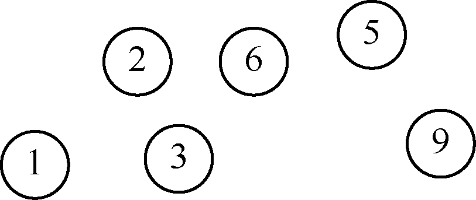
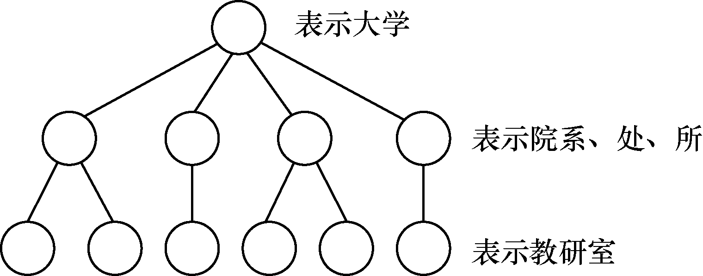
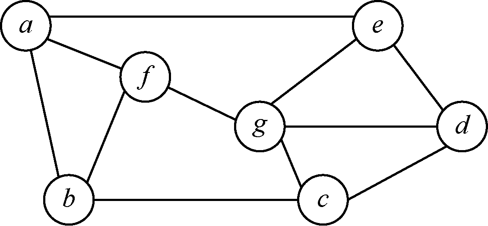

### 0.2.1　逻辑结构

数据的 **逻辑结构** （logical structure）是指数据对象中数据元素之间的逻辑关系。数据元素之间存在不同的逻辑关系，主要分为以下4种结构类型。

**集合结构** 。结构中的数据元素除了同属于一个集合外，数据元素之间没有其他关系。这就像数学中的自然数集合，集合中的所有元素都属于该集合，除此之外，没有其他特性。例如，数学中的正整数集合{1,2,3,5,6,9}，集合中的元素除了均属于正整数外，元素之间没有其他关系。数据结构中的集合类似于数学中的集合。集合结构如图0.3所示。

<b class="my_markdown">图0.3　集合结构</b>

**线性结构** 。结构中的数据元素之间是一对一的关系。线性结构如图0.4所示。数据元素之间有一种先后的次序关系，a、b、c是一个线性表，其中，a是b的“前驱”，b是a的“后继”。

<b class="my_markdown">图0.4　线性结构</b>

**树形结构** 。结构中的数据元素之间存在一种一对多的层次关系，树形结构如图0.5所示。这就像大学的组织结构图，大学下面是教学的院系、处、所及一些教研室。

<b class="my_markdown">图0.5　树形结构</b>

**图结构** 。结构中的数据元素是多对多的关系，图0.6所示为一个图结构。城市之间的交通路线图就是多对多的关系，假设a、b、c、d、e、f、g是7个城市，城市a和城市b、e、f之间都存在一条直达路线，城市b和a、c、f之间也存在一条直达路线。

<b class="my_markdown">图0.6　图结构</b>

