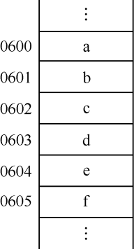
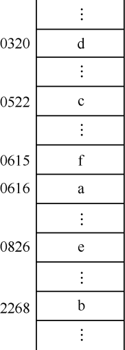

### 0.2.2　存储结构

**存储结构** （storage structure）也称为 **物理结构** （physical structure），指的是数据的逻辑结构在计算机中的存储形式。数据的存储结构应能正确反映数据元素之间的逻辑关系。

数据元素的存储结构形式通常有两种——顺序存储结构和链式存储结构。顺序存储结构是把数据元素存放在一组地址连续的存储单元里，其数据元素间的逻辑关系和物理关系是一致的。顺序存储结构如图0.7所示。链式存储结构是把数据元素存放在任意的存储单元里，这些存储单元可以是连续的，也可以是不连续的，数据元素的物理关系并不能反映其逻辑关系，因此需要借助指针来表示数据元素之间的逻辑关系。链式存储结构如图0.8所示。

<b class="my_markdown">图0.7　顺序存储结构</b>

<b class="my_markdown">图0.8　链式存储结构</b>

数据的逻辑结构和存储结构是密切相关的，一个算法的设计取决于选定的数据逻辑结构，而算法的实现依赖于所采用的存储结构。对于顺序存储结构，可用C语言中的一维数组类型来描述；对于链式存储结构，可用C语言中的自引用类型即结构体来描述。

