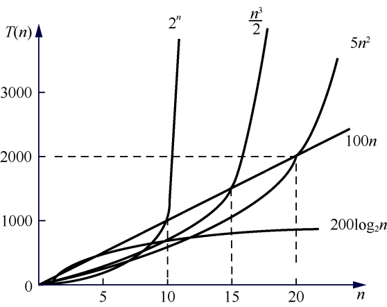

### 0.5.2　算法的时间复杂度

算法执行时间需通过依据该算法编制的程序在计算机上运行时所耗费的时间来度量，而一个算法在计算机上的执行时间通常用时间复杂度进行度量。

在进行算法分析时，语句总的执行次数T(n)是关于问题规模n的函数，通过分析T(n)随n的变化情况来确定T(n)的数量级。算法的时间复杂度也就是算法的时间量度，记作T(n)=O(f(n))。

O(f(n))表示随问题规模n的增大，算法的执行时间的增长率和f(n)的增长率相同，称作算法的 **渐近时间复杂度** （asymptotic time complexity），简称时间复杂度。其中，f(n)是问题规模n的某个函数。

一般情况下，随着n的增大，T(n)的增长率较低的算法为最优的算法。例如，请分别对以下3个程序段中的基本操作k=k+1的时间复杂度进行分析。

```c
k=k+1;
for（i=1;i<=n;i++）
 k=k+1;
for（i=1;i<=n;i++）
for（j=1;j<=n;j++）
 k=k+1;
```

程序段1的时间复杂度为O(1)，称为常量阶；程序段2的时间复杂度为O(n)，称为线性阶；程序段3的时间复杂度为O(n<sup class="my_markdown">2</sup>)，称为平方阶。

一些常见的时间复杂度量级从小到大依次是O(1)<O(log<sub class="my_markdown">2</sub>n)<O(n)<O(n<sup class="my_markdown">2</sup>)<O(n<sup>3</sup>)<O(2<sup class="my_markdown">n</sup>)<O(n!)。

时间复杂度是衡量算法性能的重要指标之一。一般情况下，具有指数级的时间复杂度的算法是当n足够小时才使用的算法。具有常量阶、线性阶、对数阶、平方阶和立方阶的时间复杂度的算法是常用的算法。一些常见函数的增长率如图0.9所示。


<center class="my_markdown"><b class="my_markdown">图0.9　常见函数的增长率</b></center>

一般情况下，算法的时间复杂度只需要考虑问题规模n的增长率或阶数。例如以下程序段。

```c
for(i=2;i<=n;i++)
   for(j=2;j<=i-1;j++)
   {
      k++;
      a[i][j]=x;
   }
```

一条语句的执行时间等于该条语句的重复执行次数和执行该语句一次所需时间的乘积，其中该语句的重复执行次数称为 **语句频度** （frequency count）。

语句k++的执行次数关于n的增长率为n<sup class="my_markdown">2</sup>，它是语句频度(n−1)(n−2)/2中增长最快的项。

在某些情况下，算法中基本操作的重复执行次数除了依赖数据集大小，还依赖数据集初始值状态。例如，以下的冒泡排序算法中基本操作的重复执行次数就依赖初始数据的排列状态。

```c
void BubbleSort(int a[],int n)
{
   int i,j,t;
   change=TRUE;
   for(i=1;i<=n-1&&change;i++)
   {
      change=FALSE;
          for(j=1;j<=n-i;j++)
             if(a[j]>a[j+1])
             {
                   t=a[j];
                   a[j]=a[j+1];
                   a[j+1]=t;
                   change=TRUE;
             }
      }
}
```

交换相邻两个整数为该算法中的基本操作。当数组a中的初始序列从小到大有序排列时，基本操作的执行次数为0；当数组中初始序列从大到小排列时，基本操作的执行次数为n(n−1)/2。对这类算法的分析有两种方法：一种方法是计算所有情况的平均值，这种方法计算出的时间复杂度称为平均时间复杂度；另一种方法是计算最坏情况下的时间复杂度，这种方法计算出的时间复杂度称为最坏时间复杂度。若数组a中初始输入数据出现n! 种排列情况的概率相等，则冒泡排序的平均时间复杂度为T(n)=O(n<sup class="my_markdown">2</sup>)。

然而，在很多情况下，若各种输入数据出现的概率难以确定，算法的平均复杂度也就难以确定。因此，更常用的办法是讨论算法在最坏情况下的时间复杂度，即分析最坏情况以估算算法执行时间的上界。例如，对于上面的冒泡排序，当数组a中初始序列从大到小有序排列时，则冒泡排序算法在最坏情况下的时间复杂度为T(n)=O(n<sup class="my_markdown">2</sup>)。讨论时间复杂度时，若没有特殊说明，一般都指的是最坏情况下的时间复杂度。

