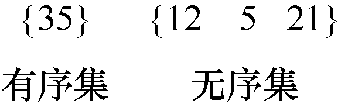
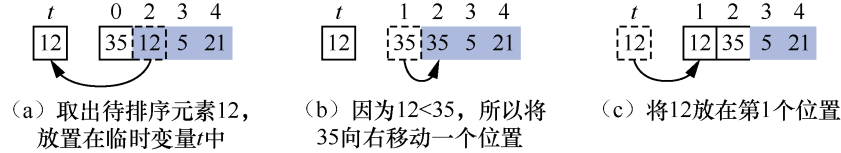
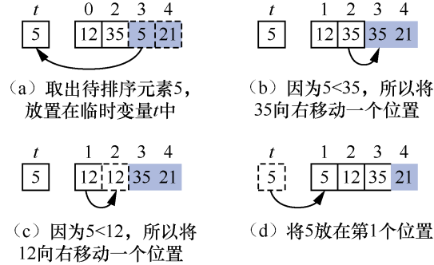
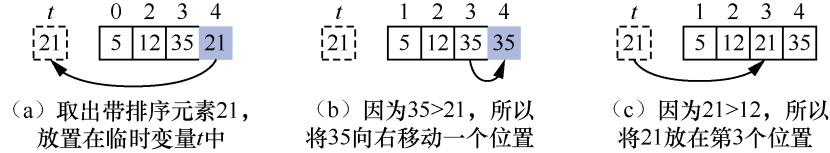
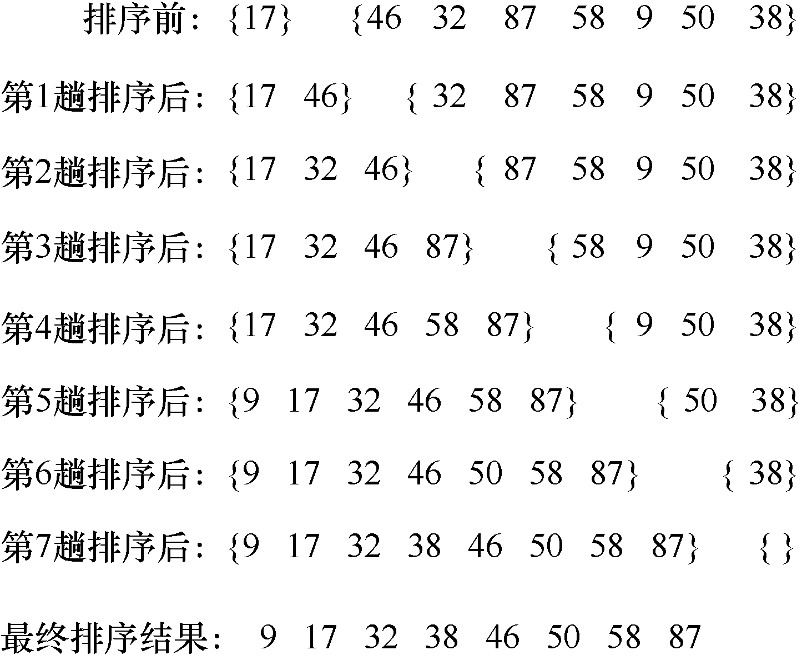
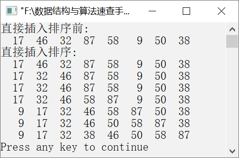

### 10.2.1　直接插入排序


**问题描述**


编写算法，利用直接插入排序让元素序列{17,46,32,87,58,9,50,38}按照从小到大的顺序排列。


**【分析】**

直接插入排序是一种非常简单的插入排序算法。它的基本算法思想描述如下。

假设待排序元素有n个。初始时，有序集中只有1个元素，无序集中是剩下的（n−1）个元素。例如，有4个待排序元素35、12、5和21，排序前的初始状态如图10.1所示。


<center class="my_markdown"><b class="my_markdown">图10.1　待排序元素的初始状态</b></center>

第1趟排序中，将无序集中的第1个元素（也就是12）与有序集中的元素35进行比较。因为35>12，所以需要先将35向右移动一个位置，然后将12插入有序集中的第1个位置，如图10.2（a）～（c）所示。其中，阴影部分表示无序集，白色部分表示有序集。


<center class="my_markdown"><b class="my_markdown">图10.2　第1趟排序</b></center>

第2趟排序中，将无序集的第2个元素5依次与有序集中的元素从右到左比较。即先与35比较，因为5<35，所以先将35向右移动一个位置，然后将5与第1个元素12比较。因为5<12，所以将12向右移动一个位置，将5放在第1个位置。第2趟排序如图10.3（a）～（d）所示。


<center class="my_markdown"><b class="my_markdown">图10.3　第2趟排序</b></center>

第3趟排序中，将无序集中的元素21与有序集中的元素从右到左依次比较。先与35比较，因为21<35，所以需将35向右移动一个位置并与前一个元素12比较。由于21>12，故需将21放置在12与35之间，即插入第3个位置。第3趟排序如图10.4（a）～（c）所示。

经过以上排序之后，有序集有4个元素，无序集为空集。此时直接插入排序完毕，整个序列变成一个有序序列。


<center class="my_markdown"><b class="my_markdown">图10.4　 第3趟排序</b></center>

**【示例】**

假设待排序元素有8个，分别是17、46、32、87、58、9、50、38。使用直接插入排序对元素进行排序的过程如图10.5所示。


<center class="my_markdown"><b class="my_markdown">图10.5　直接插入排序</b></center>

在图10.5中，所有元素被花括号分为两个集合，前一个为有序集，后一个为无序集。直接插入排序就是将无序集中的元素依次插入有序集中的对应位置，直到无序集已空。


第10章\实例10-01.cpp

```c
/********************************************
*实例说明：直接插入排序
*********************************************/
#include<stdio.h>
void PrintArray(int a[],int n);
void main()
{
    int a[]={17,46,32,87,58,9,50,38};
    int t,i,j,n;
    n=sizeof(a)/sizeof(a[0]);
    printf("直接插入排序前:\n");
    PrintArray(a,n);
    printf("直接插入排序:\n");
for(i=1;i<n;i++)
{
    t=a[i];
    for(j=i-1;j>=0&&t<a[j];j--)
        a[j+1]=a[j];
        a[j+1]=t;
PrintArray(a,n);
}    
}
void PrintArray(int a[],int n)
{
    int i;
    for(i=0;i<n;i++)
        printf("%4d",a[i]);
        printf("\n");
}
```

运行结果如图10.6所示。


<center class="my_markdown"><b class="my_markdown">图10.6　运行结果</b></center>

**【主要用途】**

直接插入排序实现简单，适用于待排序元素较少且元素基本有序的情况。在元素基本有序时，需要比较的次数和移动的次数很少，因此在这种情况下使用直接插入排序最佳。

**【稳定性与复杂度】**

直接插入排序属于稳定排序，直接插入排序算法的时间复杂度为O(n<sup class="my_markdown">2</sup>)（n为元素个数），空间复杂度为O(1)。

