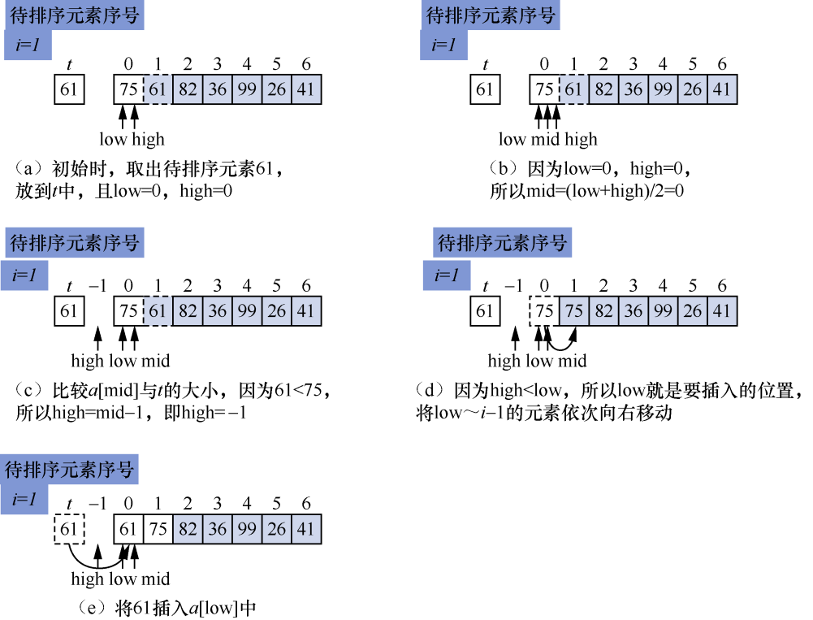
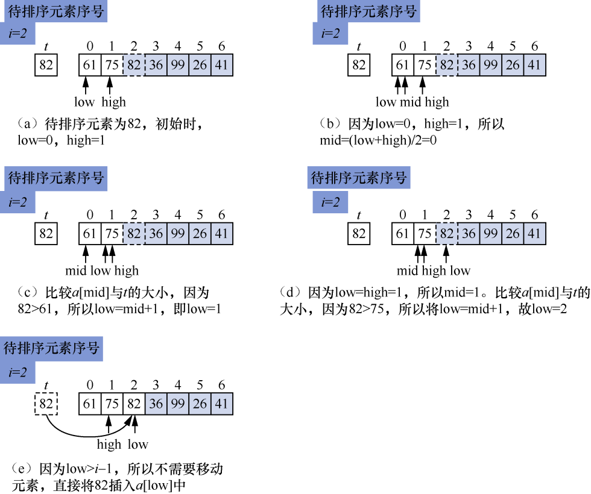
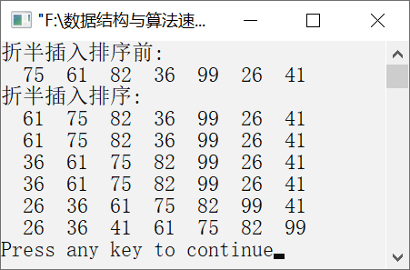

### 10.2.2　折半插入排序


**问题描述**


实现折半插入排序算法，让元素序列{75, 61, 82, 36, 99, 26, 41}按照从小到大的顺序排列。


**【分析】**

折半插入排序是对直接插入排序的一种改进。主要思想是在查找插入位置的过程中引入折半查找算法，利用折半查找算法在有序集中确定待排序元素的插入位置。

**【与直接插入排序的区别】**

直接插入排序从右到左按顺序查找插入的位置，折半插入排序在有序集中查找插入的位置。

**【示例】**

假设有7个待排序元素——75、61、82、36、99、26、41。使用折半插入排序算法对该元素序列进行第1趟排序的过程如图10.7（a）～（e）所示。


<center class="my_markdown"><b class="my_markdown">图10.7　使用折半插入排序算法的第1趟排序过程</b></center>

其中，low、high分别表示待插入序列中的第一个元素的下标和最后一个元素的下标，mid为中间的元素的下标。i=1表示第1趟排序，待排序元素为a[1]，t存放的是待排序元素。当low>high时，low指向元素要插入的位置。依次将low～i−1的元素向后移动一个位置，然后将t的值插入a[low]中。

第2趟折半插入排序过程如图10.8（a）～（e）所示。


<center class="my_markdown"><b class="my_markdown">图10.8　第2趟折半插入排序过程</b></center>

从以上两趟排序过程可以看出，折半插入排序与直接插入排序的区别仅仅在于查找插入位置的方法不同。一般情况下，折半查找的效率要高于顺序查找的效率。


第10章\实例10-02.cpp

```c
/********************************************
*实例说明：折半插入排序
*********************************************/
#include<stdio.h>
void PrintArray(int a[],int n);
void main()
{
    int a[]={75,61,82,36,99,26,41};
    int t,i,j,low,high,mid,n;
    n=sizeof(a)/sizeof(a[0]);
    printf("折半插入排序前:\n");
    PrintArray(a,n);
    printf("折半插入排序:\n");
    for(i=1;i<n;i++)
{
        t=a[i];
        for(low=0,high=i-1;high>=low;)
{
            mid=(low+high)/2;
            if(t<a[mid])
            high=mid-1;
            else
            low=mid+1;
}
for(j=i-1;j>=low;j--)
    a[j+1]=a[j];
    a[low]=t;
    PrintArray(a,n);
}    
}
void PrintArray(int a[],int n)
{
    int i;
    for(i=0;i<n;i++)
        printf("%4d",a[i]);
        printf("\n");
}
```

运行结果如图10.9所示。


<center class="my_markdown"><b class="my_markdown">图10.9　运行结果</b></center>

**【插入排序的链式实现】**

L指向有序链表，p指向待排序链表。初始时，令L−>next=NULL，即有序链表为空。若有序链表为空，则将p指向的节点直接插入空链表中。然后将p指向的第二个节点与L所指向的有序链表中的每一个节点比较，并将节点*p插入L所指向的有序链表的相应位置，使其有序排列。重复执行以上操作，直到待排序链表中的所有节点都插入L指向的有序链表中。此时，L所指向的就是一个有元素的有序链表。

```c
void InsertSort(LinkList L)
/*插入排序的链式实现*/
{
    ListNode *p=L->next,*pre,*q;
    L->next=NULL;           
    while(p!=NULL)          /*p指向待排序的节点*/
    {
        if(L->next==NULL)   /*如果*p是第一个节点，则插入L指向的有序链表，并令已排序的最后一个节点的
        指针域为空*/
        {
            L->next=p;
            p=p->next;
            L->next->next=NULL;
        }
        else                /*p指向待排序的节点，在L指向的已经排好序的链表中查找插入位置*/
        {
            pre=L;
            q=L->next;    
            while(q!=NULL&&q->data<p->data)   
            {
                pre=q;
                q=q->next;
            }
            q=p->next;           
            p->next=pre->next;   
            pre->next=p;
            p=q;                 
        }
    }
}
```

**【主要用途】**

与直接插入排序类似，折半插入排序通常用于待排序元素的个数较少的情况。如果待排序元素基本有序，则最好采用直接插入排序算法。

**【稳定性与复杂度】**

折半插入排序也是一种稳定排序算法。虽然折半插入排序在查找插入的位置时改进了查找方法，减少了比较次数，比较次数由O(n)变为O(nlog<sub class="my_markdown">2</sub>n)，但是移动元素的时间复杂度仍然没有改变，因此折半查找排序算法的整体时间复杂度仍然为O(n<sup class="my_markdown">2</sup>)，它的空间复杂度为O(1)。

