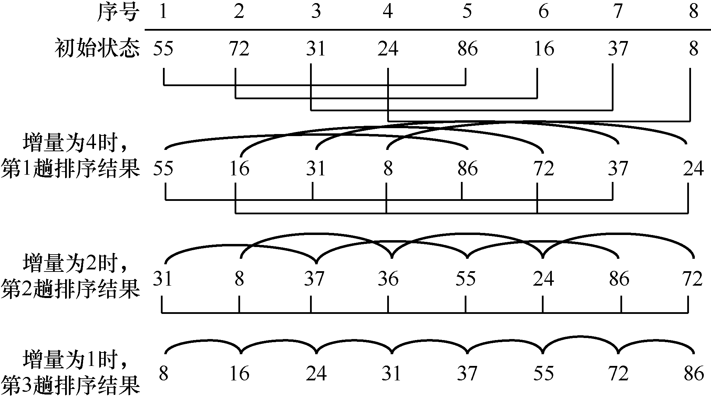
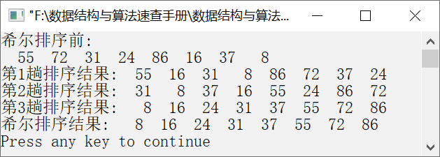

### 10.2.3　希尔排序


**问题描述**


利用希尔排序算法，让元素序列{55, 72, 31, 24, 86, 16, 37, 8}按照从小到大的顺序排列。


**【分析】**

希尔排序也属于插入排序算法。希尔排序通过减小增量（距离），将待排序元素划分为若干个子序列，分别对各个子序列按照直接插入排序算法进行排序。当增量为1时，待排序元素构成一个子序列，对该序列排序完毕后希尔排序算法结束。

**【与直接插入排序、折半插入排序的区别】**

直接插入排序和折半插入排序中，待排序元素构成一个子序列；希尔排序中，待排序元素被划分为若干个子序列，需要分别对每个子序列进行排序。

**【示例】**

假设待排序元素有8个，分别是55、72、31、24、86、16、37、8。假设增量依次为4、2、1，使用希尔排序对该元素序列进行排序，过程如图10.10所示。


<center class="my_markdown"><b class="my_markdown">图10.10　希尔排序过程</b></center>

当增量为4时，第1个元素与第5个元素为一组。第2个元素与第6个元素为一组，第3个元素与第7个元素为一组，第4个元素与第8个元素为一组。本组内的元素进行直接插入排序，即完成第1趟希尔排序。当增量为2时，第1、3、5、7个元素为一组，第2、4、6、8个元素为一组，本组内的元素进行直接插入排序，即完成第2趟希尔排序。当增量为1时，将所有的元素进行直接插入排序。此时，所有的元素都从小到大排列，希尔排序算法结束。


第10章\实例10-03.cpp

```c
/********************************************
*实例说明：希尔排序
*********************************************/
#include<stdio.h>
void ShellSort(int a[],int length,int delta[],int m);
void ShellInsert(int a[],int length,int c);
void DispArray(int a[],int length);
void main()
{
    int a[]={55,72,31,24,86,16,37,8};
    int delta[]={4,2,1},m=3,n;
    n=sizeof(a)/sizeof(a[0]);
    printf("希尔排序前:\n");
    DispArray(a,n);
    ShellSort(a,n,delta,m);
    printf("希尔排序结果:");
    DispArray(a,n);
}
void ShellInsert(int a[],int length,int c)
/*对数组中的元素进行希尔排序，c是增量*/
{
int i,j,t;
for(i=c;i<length;i++)     
{
    if(a[i]<a[i-c])       
    {
        t=a[i];
        for(j=i-c;j>=0&&t<a[j];j=j-c)
        a[j+c]=a[j];
        a[j+c]=t;         
    }
}
}
void ShellSort(int a[],int length,int delta[],int m)
/*希尔排序，每次调用ShellInsert函数，delta是存放增量的数组*/
{
int i;
for(i=0;i<m;i++)          /*进行m次希尔排序*/
{
    ShellInsert(a,length,delta[i]);
    printf("第%d趟排序结果:",i+1);
    DispArray(a,length);
    }
}
void DispArray(int a[],int length)
/*输出数组a中的元素*/
{
    int i;
    for(i=0;i<length;i++)
        printf("%4d",a[i]);
        printf("\n");
}
```

运行结果如图10.11所示。


<center class="my_markdown"><b class="my_markdown">图10.11　运行结果</b></center>

**【主要用途】**

希尔排序算法可以使值较小的元素很快向前移动。当待排序元素基本有序时，再使用直接插入排序处理，效率会高很多。希尔排序主要用在元素个数在5000以下且速度要求并不是很高的场合。

**【稳定性与复杂度】**

希尔排序是一种不稳定的排序算法。由于增量的选择是随机的，因此分析希尔排序算法的时间复杂度就变成一件非常复杂的事情。但是经过研究发现，当增量序列为2<sup class="my_markdown">t</sup><sup>−</sup><sup class="my_markdown">k</sup><sup>+1</sup>（其中，t为排序趟数，1
k
t
）时，希尔排序的时间复杂度为O(n<sup>3/2</sup>)。希尔排序的空间复杂度为O(1)。

