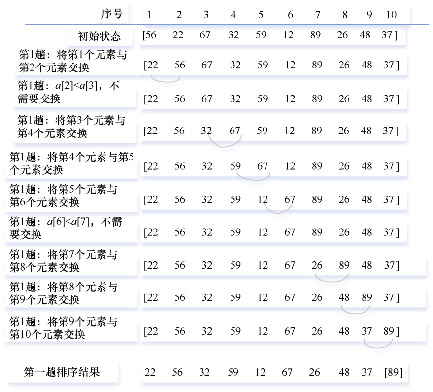
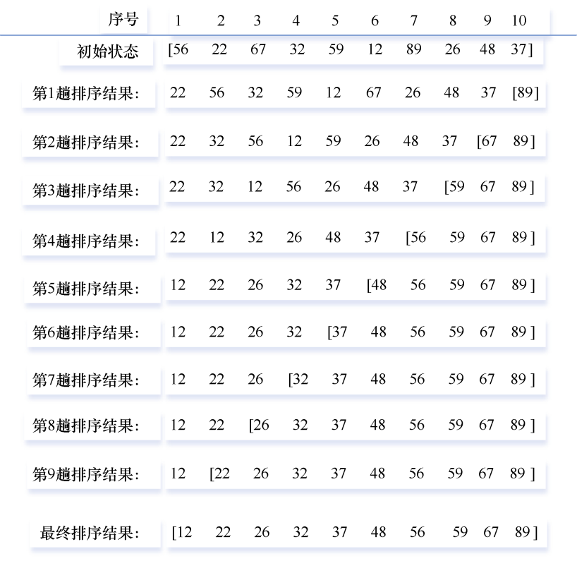
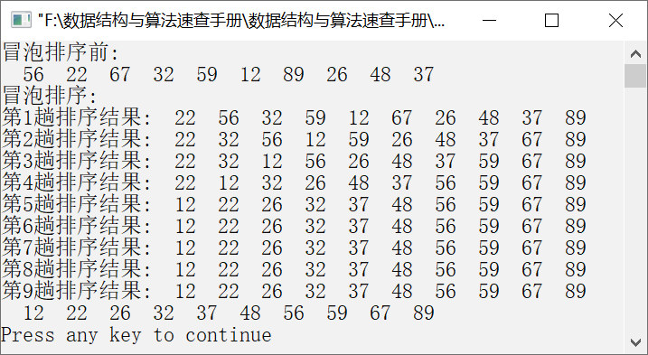

### 10.3.1　冒泡排序


**问题描述**


实现冒泡排序算法，让元素序列{56,22,67,32,59,12,89,26,48,37}从小到大排序。

**【分析】**

冒泡排序是一种简单的交换排序算法，它通过交换相邻的两个元素，逐步将待排序序列变成有序序列。它的基本算法思想描述如下。

假设待排序元素有n个。从第1个元素开始，依次交换相邻的两个逆序元素，直到到达最后一个元素为止。当第1趟排序结束时，就会将最大的元素移动到序列的末尾。然后按照以上方法进行第2趟排序，第二大的元素将会被移动到序列的倒数第2个位置。以此类推，经过（n−1）趟排序后，整个元素序列就成了有序的序列。每趟排序过程中，值小的元素向前移动，值大的元素向后移动，就像气泡一样向上升，因此将这种排序算法称为冒泡排序。

**【示例】**

例如，一个元素序列为{56,22,67,32,59,12,89,26,48,37}，对该元素序列进行冒泡排序，第1趟冒泡排序过程如图10.12所示。


<center class="my_markdown"><b class="my_markdown">图10.12　第1趟冒泡排序过程</b></center>

经过第1趟冒泡排序后，值最大的元素89移动到了序列的最后。按以上方法，对第1个元素到倒数第1个元素重复以上过程，倒数第二大的元素将排在倒数第2个位置。以此类推，直到所有的元素均有序，冒泡排序结束。

对元素序列{56,22,67,32,59,12,89,26,48,37}进行冒泡排序的全过程如图10.13所示。


<center class="my_markdown"><b class="my_markdown">图10.13　冒泡排序的全过程</b></center>

在冒泡排序中，如果待排序元素的个数为n，则需要（n−1）趟冒泡排序。对于第i趟冒泡排序，需要比较的次数为（i−1）。


第10章\实例10-04.cpp

```c
/********************************************
*实例说明：冒泡排序
*********************************************/
#include<stdio.h>
void PrintArray(int a[],int n);
void BubbleSort(int a[],int n);
void main()
{
    int a[]={56,22,67,32,59,12,89,26,48,37};
    int n=sizeof(a)/sizeof(a[0]);
    printf("冒泡排序前:\n");
    PrintArray(a,n);
    printf("冒泡排序:\n");
    BubbleSort(a,n);
}
void BubbleSort(int a[],int n)
{
    int i,j,t;
    for(i=1;i<n;i++)
    {
    for(j=0;j<n-i;j++)
    {
        if(a[j]>a[j+1])
        {
            t=a[j];
            a[j]=a[j+1];
            a[j+1]=t;
        }
    }
    printf("第%d趟排序结果:",i);
    PrintArray(a,n);
    }
}
void PrintArray(int a[],int n)
{
int i;
for(i=0;i<n;i++)
    printf("%4d",a[i]);
    printf("\n");
}
```

运行结果如图10.14所示。


<center class="my_markdown"><b class="my_markdown">图10.14　运行结果</b></center>

**【主要用途】**

冒泡排序算法的实现简单，适用于待排序元素较少且对速度要求不高的场合。

**【稳定性与复杂度】**

冒泡排序是一种稳定的排序算法。假设待排序元素为n个，则需要进行（n−1）趟冒泡排序，每趟冒泡排序需要进行（n−i）次比较，其中i=1,2,…,n−1。因此，冒泡排序的比较次数为
，移动元素的次数为，它的时间复杂度为O(n<sup class="my_markdown">2</sup>)，空间复杂度为O(1)。

**【双向冒泡排序】**

双向冒泡排序就是从前后两个方向交替进行扫描，第一趟把值最大的元素排在序列的最后面，第二趟把值最小的元素排在序列的最前面。如此反复进行，直到序列中不存在逆序元素。奇数趟中从前向后扫描相邻元素，遇到逆序则交换之，直至把序列中最大的元素排在最后。偶数趟中从后向前扫描相邻元素，遇到逆序则交换之，直至将值最小的元素排在最前面。

```c
void BubbleSort2(int a[],int n)
/*双向冒泡排序，从前后两个方向进行冒泡排序*/
{
int i,t,flag=1;            /*一趟排序后元素是否有交换*/
int low=0,high=n-1;
while(low<high && flag)    /*当flag为0时说明已没有逆序元素*/
{
    flag=0;                /*每趟开始时将flag置为0*/
for(i=low;i<high;i++)      /*从前向后进行冒泡排序*/
{
    if(a[i]>a[i+1])
    {
        t=a[i];
        a[i]=a[i+1];
        a[i+1]=t;
        flag=1;           
}
}
high--;                    /*更新上界*/
for(i=high;i>low;i--)      /*从后向前进行冒泡排序*/
{
    if(a[i]<a[i-1])
    {
        t=a[i];
        a[i]=a[i-1];
        a[i-1]=t;
        flag=1;           
}
}
low++;                     /*更新下界*/
printf("第%d趟排序结果:",i);
PrintArray(a,n);
}
}
```

如果flag为1，则表示序列中存在逆序元素，需要进行交换；如果flag为0，则表示序列中不存在逆序元素，不需要进行交换。在比较两个元素前，将标志flag置为0，如果元素序列中存在逆序，则将flag置为1。

