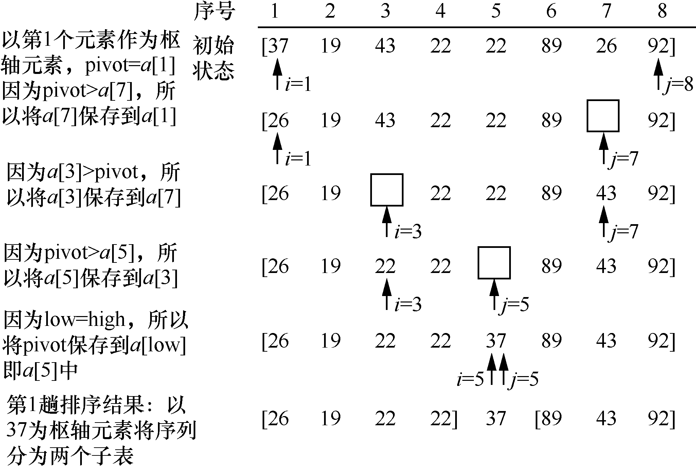
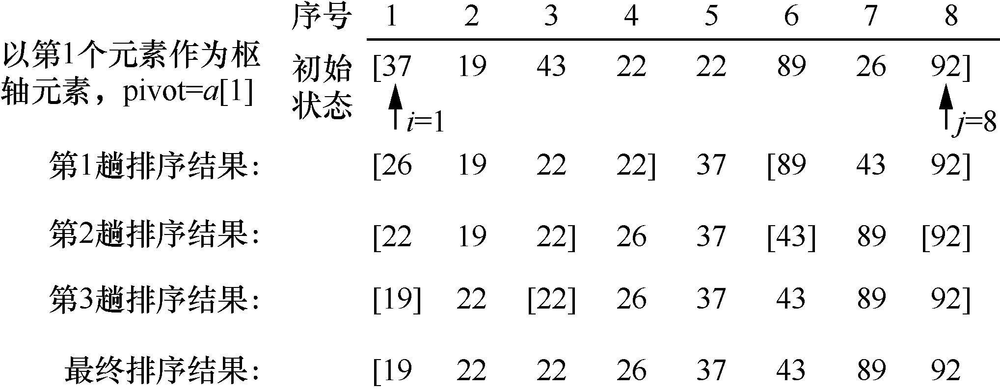
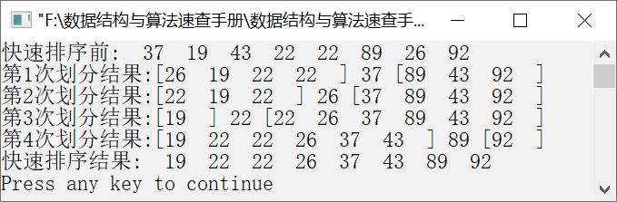

### 10.3.2　快速排序


**问题描述**


编写一个快速排序算法，让元素序列{37,19,43,22,22,89,26,92}按照从小到大的顺序排列。


**【分析】**

快速排序是冒泡排序算法的改进，也属于交换排序算法。它的基本算法思想描述如下。

假设待排序元素个数为n，存放在数组a[1, …, n]中。令第1个元素为参考元素（枢轴元素），即pivot=a[1]。初始时，i=1，j=n，然后按照以下步骤操作。

（1）从第j个元素开始向前依次将每个元素与pivot比较。如果当前元素大于或等于pivot，则比较前一个元素与pivot的大小，即比较a[j−1]与pivot的大小；否则，将当前元素移动到第i个位置并执行步骤（2）。

（2）从第i个元素开始向后依次将每个元素与pivot比较。如果当前元素小于pivot，则比较后一个元素与pivot的大小，即比较a[i+1]与pivot的大小；否则，将当前元素移动到第j个位置并执行步骤（3）。

（3）重复执行步骤（1）和（2），直到i
j，将元素pivot移动到a[i]中。此时，整个元素序列被划分为两个部分（子序列）：小于a[i]的元素位于第i个位置之前，大于或等于a[i]的元素位于第i个位置之后。这样就完成一趟快速排序，即一次划分。

按照以上方法，对每个子序列进行类似的划分操作，直到每个子序列都只有一个元素为止，这样整个元素序列就构成了一个有序的序列。

**【示例】**

例如，一个元素序列为{37,19,43,22,22,89,26,92}，根据快速排序算法思想，第1趟快速排序过程如图10.15所示。


<center class="my_markdown"><b class="my_markdown">图10.15　第1趟快速排序过程</b></center>

从图10.15容易看出，当第1趟快速排序完毕之后，整个元素序列被枢轴元素37划分为两个子序列，左边子序列的元素值都小于37，右边子序列的元素值都大于37。使用快速排序对示例中的元素序列进行排序的整个过程如图10.16所示。

通过图10.16所示的排序过程不难看出，快速排序算法可以通过递归调用实现。快速排序的过程其实就是不断地对元素序列进行划分，直到每一个子序列都不能划分时即完成快速排序。


<center class="my_markdown"><b class="my_markdown">图10.16　快速排序的整个过程</b></center>


第10章\实例10-05.cpp

```c
/********************************************
*实例说明：快速排序
*********************************************/
#include<stdio.h>
void DispArray(int a[],int n);
void DispArray2(int a[],int n,int pivot,int count);
void QSort(int a[],int n,int low,int high);
void QuickSort(int a[],int n);
int Partition(int a[],int low,int high);
void QSort(int a[],int n,int low,int high)
/*利用快速排序算法对数组a中的元素排序*/
{
    int pivot;
    static count=1;
    if(low<high)                    
    {
        pivot=Partition(a,low,high);
        DispArray2(a,n,pivot,count);
        count++;
        QSort(a,n,low,pivot-1);     
        QSort(a,n,pivot+1,high);    
    }
}
void QuickSort(int a[],int n)
/*对数组a进行快速排序*/
{
    QSort(a,n,0,n-1);
}
int Partition(int a[],int low,int high)
/*对数组a的元素进行排序*/
{
    int t,pivot;
    pivot=a[low];   
    t=a[low];
    while(low<high) 
    {
        while(low<high&&a[high]>=pivot)
            high--;
        if(low<high)
        {
            a[low]=a[high];
            low++;
        }
        while(low<high&&a[low]<=pivot)
            low++;
        if(low<high)   
        {
            a[high]=a[low];
            high--;
        }
        a[low]=t;     
    }
    return low;      
}
void DispArray2(int a[],int n,int pivot,int count)
/*输出每次划分的结果*/
{
    int i;
    printf("第%d次划分结果:[",count);
    for(i=0;i<pivot;i++)
        printf("%-4d",a[i]);
    printf("]");
    printf("%3d ",a[pivot]);
    printf("[");
    for(i=pivot+1;i<n;i++)
        printf("%-4d",a[i]);
    printf("]");
    printf("\n");
}
void main()
{
    int a[]={37,19,43,22,22,89,26,92};
    int n=sizeof(a)/sizeof(a[0]);
    printf("快速排序前:");
    DispArray(a,n);
    QuickSort(a,n);
    printf("快速排序结果:");
    DispArray(a,n);
}
void DispArray(int a[],int n)
/*输出数组中的元素*/
{
    int i;
    for(i=0;i<n;i++)
        printf("%4d",a[i]);
    printf("\n");
}
```

运行结果如图10.17所示。


<center class="my_markdown"><b class="my_markdown">图10.17　运行结果</b></center>

**【主要用途】**

快速排序算法是冒泡排序算法的改进，实现比较复杂，它主要用在需要对大量元素进行排序的情况中。它的效率要远高于冒泡排序，在元素个数特别多的情况下这一优势特别明显。

**【稳定性与复杂度】**

快速排序是一种不稳定的排序算法。

在最好的情况下，每趟排序都是将元素序列正好划分为两个等长的子序列。这样，快速排序中子序列的划分过程就是创建完全二叉树的过程，划分的次数等于二叉树的深度即log<sub class="my_markdown">2</sub>n，因此快速排序总的比较次数为T(n)
n+2T(n/2)
n+2[n/2+2T(n/4)]=2n+ 4T(n/4) 
3n+8T(n/8) 
…
nlog<sub class="my_markdown">2</sub>n+nT(1)。因此，在最好的情况下，快速排序的时间复杂度为O(n<sup class="my_markdown">2</sup>)。

在最坏的情况下，待排序元素序列已经是有序的，则时间的花费主要集中在元素的比较次数上。第1趟需要比较（n−1）次，第2趟需要比较（n−2）次，以此类推，共需要比较n(n−1)/2次。因此时间复杂度为O(n<sup class="my_markdown">2</sup>)。

在平均情况下，快速排序的时间复杂度为O(nlog<sub class="my_markdown">2</sub>n)。

快速排序的空间复杂度为O(log<sub class="my_markdown">2</sub>n)。

