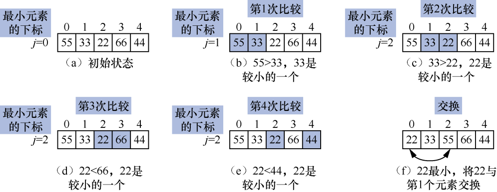
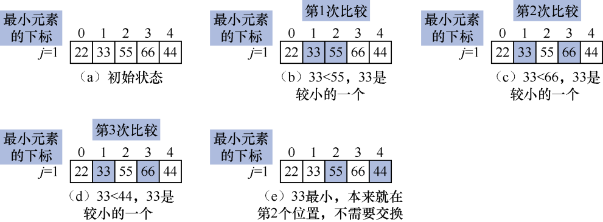
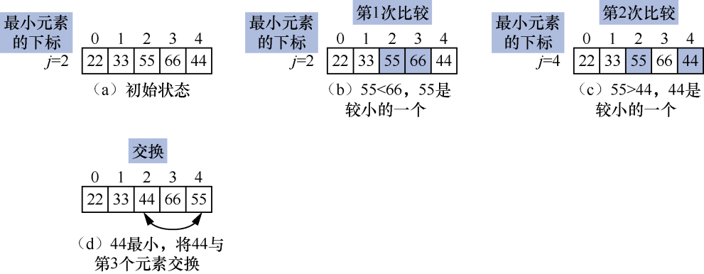
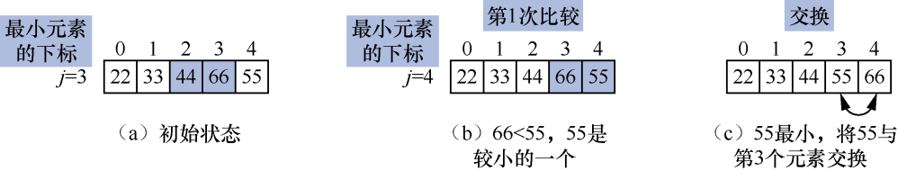
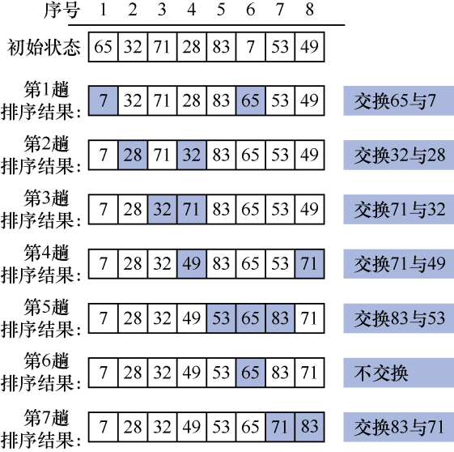
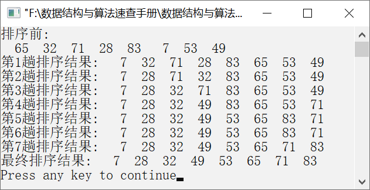

### 10.4.1　简单选择排序


**问题描述**


实现算法，要求使用简单选择排序算法让元素序列{65,32,71,28,83,7,53,49}按照从小到大的顺序排列。


**【分析】**

简单选择排序是一种简单的选择排序算法，它的基本算法思想描述如下。

假设待排序的元素有n个。在第1趟排序过程中，从n个元素中选择最小的元素，并将其放在元素序列的最前面（即第1个位置）。在第2趟排序过程中，从剩余的（n−1）个元素中，选择最小的元素，将其放在第2个位置。以此类推，直到没有待比较的元素，简单选择排序结束。

例如，给定一个元素序列{55,33,22,66,44}。简单选择排序的过程如下。

（1）从第1个元素开始，将第1个元素与第2个元素进行比较，因为55>33，所以33是较小的元素。继续将33与第3个元素22比较，因为33>22，所以22成为较小的元素。将22与第4个元素66比较，因为22<66，所以22仍然是较小的一个元素。最后将22与第5个元素44比较，因为22<44，所以22就是这5个元素中最小的元素，并将22与第1个元素交换。此时，完成第1趟排序。第1趟排序过程如图10.18（a）～（f）所示。初始时，假设最小元素的下标为0。在比较过程中，用j记下最小元素的下标。第1趟排序后，最小的元素位于第1个位置上（处于正确的位置）。


<center class="my_markdown"><b class="my_markdown">图10.18　第1趟排序过程</b></center>

（2）从第2个元素开始，将第2个元素与第3个元素进行比较，因为33<55，所以33是较小的元素。继续将33与第4个元素66比较，因为33<66，所以33仍然是较小的元素。将33与第5个元素44比较，因为33<44，所以33就是最小的元素。此时，完成第2趟排序。第2趟排序过程如图10.19（a）～（e）所示。在第2趟排序过程中，33是最小的元素，本来就位于第2个位置，不需要移动元素。


<center class="my_markdown"><b class="my_markdown">图10.19　第2趟排序过程</b></center>

（3）从第3个元素开始，将第3个元素与第4个元素进行比较，因为55<66，所以55是较小的元素。继续将55与第5个元素44比较，因为55>44，所以44成为较小的元素，并将44与第3个元素交换。此时，完成第3趟排序。第3趟排序过程如图10.20（a）～（d）所示。到目前为止，前3个元素都已经有序，接下来只需要确定第4个元素和第5个元素的顺序即可。


<center class="my_markdown"><b class="my_markdown">图10.20　第3趟排序过程</b></center>

（4）比较第4个元素与第5个元素，即66与55的大小，因为66>55，所以55是较小的元素，并将66与55交换。此时，完成第4趟排序。第4趟排序过程如图10.21（a）～（c）所示。


<center class="my_markdown"><b class="my_markdown">图10.21　第4趟排序过程</b></center>

此时，前4个元素都已经有序并且位于正确的位置上，那么，第5个元素也位于正确的位置上。至此，简单选择排序结束。

**【示例】**

假设待排序元素有8个，分别是65、32、71、28、83、7、53、49。使用简单选择排序对该元素序列进行排序的过程如图10.22所示。待排序元素的个数为n，则需要（n−1）趟排序。对于第i趟排序，需要比较的次数为（i−1）。当第i趟排序完毕，将该趟排序过程中最小的元素放在第i个位置。此时，前i个元素都已有序且在正确的位置上。


<center class="my_markdown"><b class="my_markdown">图10.22　简单选择排序过程</b></center>


第10章\实例10-06.cpp

```c
/********************************************
*实例说明：简单选择排序
*********************************************/
#include<stdio.h>
void SelectSort(int a[],int n);
void DispArray(int a[],int n);
void main()
{
    int a[]={65,32,71,28,83,7,53,49};
    int n=sizeof(a)/sizeof(a[0]);
    printf("排序前:\n");
    DispArray(a,n);
    SelectSort(a,n);
    printf("最终排序结果:");
    DispArray(a,n);
}
void SelectSort(int a[],int n)
/*简单选择排序*/
{
    int i,j,k,t;
    for(i=0;i<n-1;i++)
{
        j=i;
        for(k=i+1;k<n;k++)
            if(a[k]<a[j])
            j=k;
            if(j!=i)      
            {
                t=a[i];
                a[i]=a[j];
                a[j]=t;
}
    printf("第%d趟排序结果:",i+1);
    DispArray(a,n);
}
}
    void DispArray(int a[],int n)
    /*输出数组中的元素*/
    {
    int i;
    for(i=0;i<n;i++)
        printf("%4d",a[i]);
    printf("\n");
}
```

运行结果如图10.23所示。


<center class="my_markdown"><b class="my_markdown">图10.23　运行结果</b></center>

**【主要用途】**

简单选择排序算法实现简单，适用于待排序元素较少且对速度要求不高的场合。

**【稳定性与复杂度】**

简单选择排序是一种不稳定的排序算法。

在最好的情况下，待排序元素按照非递减排列，则不需要移动元素。在最坏的情况下，待排序元素按照非递增排列，则在每一趟排序时都需要移动元素，移动元素的次数为3(n−1)。在任何情况下，简单选择排序算法都需要进行n(n−1)/2次的比较。综上所述，简单选择排序算法的时间复杂度是O(n<sup class="my_markdown">2</sup>)。

简单选择排序的空间复杂度是O(1)。

