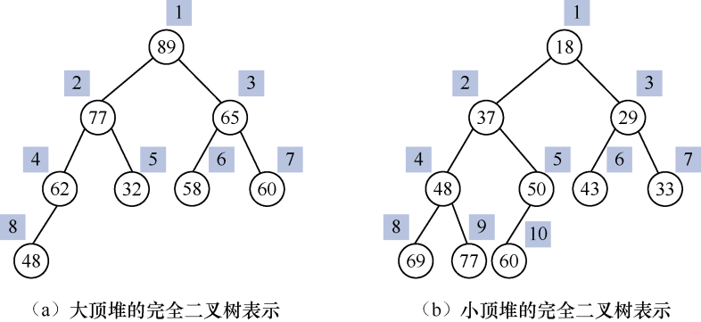
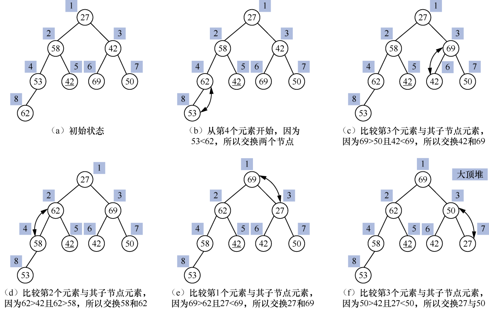
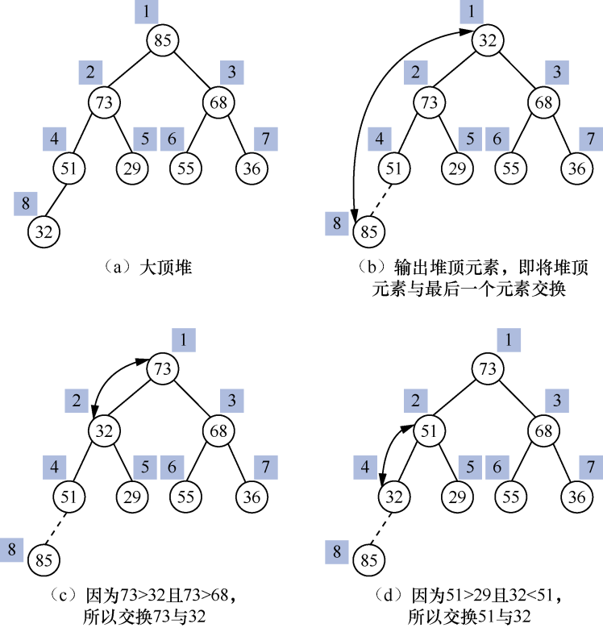
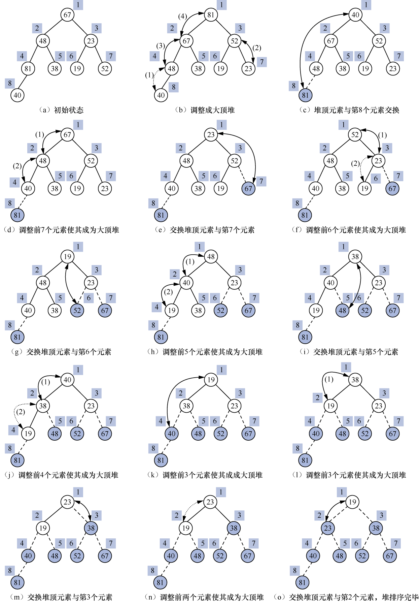
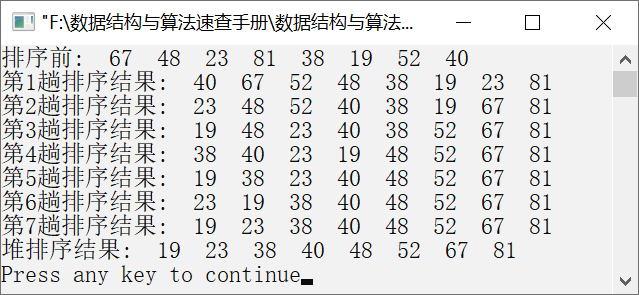

### 10.4.2　堆排序


**问题描述**


利用堆排序算法思想，让元素序列{67,48,23,81,38,19,52,40}按照从小到大的顺序排列。


**【大顶堆与小顶堆的定义】**

堆排序是简单选择排序算法的一种改进。堆排序利用完全二叉树的性质对元素进行排序，将完全二叉树从上到下、从左到右依次编号，如果每一个双亲节点的元素值大（小）于或等于子节点的元素值，则根据编号构成的元素序列就是大（小）顶堆。

假设有一个元素序列{k<sub class="my_markdown">1</sub>, k<sub>2</sub>, …, k<sub class="my_markdown">n</sub>}，如果它们满足以下关系，则称这样的元素序列为小顶堆或大顶堆。

或

其中，下标1～n分别表示第1～n个元素，i=1，2，…，
。

例如，元素序列{89,77,65,62,32,55,60,48}和{18,37,29,48,50,43,33,69,77,60}都是堆，相应的完全二叉树表示如图10.24（a）与（b）所示。


<center class="my_markdown"><b class="my_markdown">图10.24　完全二叉树表示</b></center>

在大顶堆中，根节点对应的元素值最大；在小顶堆中，根节点对应的元素值最小。

**【分析】**

假设一个大顶堆中有n个元素，将大顶堆中的根节点元素输出之后，用剩下的（n−1）个元素重新建立一个新大顶堆，并将新大顶堆的根节点元素输出。然后用剩下的（n−2）个元素重新建立大顶堆，重复执行以上操作，直到大顶堆中没有元素为止。输出的元素就组成一个有序的序列，这样的排序方法就称为堆排序。

因此，堆排序可以分为两个过程——创建堆和调整堆。

#### 1．创建堆

假设待排序元素有n个，依次存放在数组a中。第1个元素a[1]表示完全二叉树的根节点，剩下的元素a[2, …, n]依次与完全二叉树中的编号一一对应。例如，a[1]的左子节点元素存放在a[2]中，右子节点元素存放在a[3]中；a[i]的左子节点元素存放在a[2i]中，右子节点元素存放在a[2i+1]中。

如果元素序列是大顶堆，则有a[i]
a[2i]且a[i]
a[2i+1]（i=1,2,…, ）。如果元素序列是小顶堆，则有a[i]a[2i]且a[i]a[2i+1]（i=1,2,…, ）。

创建一个大顶堆就是将一个无序的元素序列构建为一个满足条件a[i]
a[2i]且a[i]
a[2i+1]
（i=1,2,…, ）的元素序列。

创建大顶堆的算法 **描述** ：从位于元素序列中的最后一个非叶子节点（即第
个元素）开始，逐层比较并调整元素的位置使其满足条件a[i]a[2i]且a[i]a[2i+1]，直到到达根节点为止。具体方法如下。

假设当前节点的序号为i，则当前元素为a[i]，其左、右子节点元素分别为a[2i]和a[2i+1]。将a[2i]和a[2i+1]中的较大者与a[i]比较。如果子节点元素值大于当前节点值，则交换两者；否则，不进行交换；逐层向上执行此操作，直到到达根节点，这样就创建了一个大顶堆。创建小顶堆的算法与创建大顶堆类似。

例如，给定一个元素序列{27,58,42,53,42,69,50,62}，创建大顶堆的过程如图10.25所示。

如图10.25（a）～（f）所示，创建后的大顶堆中的子节点元素值都小于或等于双亲节点元素值，其中，根节点的元素值69是最大的元素。创建后的大顶堆的元素序列为{69,62,50,58,42, 42,27,53}。


<center class="my_markdown"><b class="my_markdown">图10.25　创建大顶堆的过程</b></center>

#### 2．调整堆

其实，调整堆也是重新建堆的过程。由于除了堆顶元素外，剩下的元素本身就具有a[i]
a[2*i]且a[i]
a[2i+1]（i=1,2,…, ）的性质，即元素值由大到小逐层排列，因此，将剩下的元素调整成大顶堆只需要从上往下逐层比较，找出最大的元素并将其放在根节点的位置即构成了新的大顶堆。

调整堆的算法描述如下。

输出堆顶元素可以将堆顶元素放在堆的最后，即将第1个元素与最后一个元素交换，则需要调整的元素序列就是a[1, …, n−1]。从根节点开始，如果其左、右子节点元素值大于根节点元素值，则选择较大的一个与其进行交换。也就是说，如果a[2]>a[3]，则将a[1]与a[2]比较；如果a[1]>a[2]，则将a[1]与a[2]交换；否则，不交换。如果a[2]<a[3]，则将a[1]与a[3]比较；如果a[1]>a[3]，则将a[1]与a[3]交换；否则，不交换。逐层重复执行此操作，直到叶子节点，就完成了堆的调整，构成了一个新堆。

例如，一个大顶堆的元素序列为{85,73,68, 51,29,55,36,32}，输出85后大顶堆的调整过程如图10.26（a）～（d）所示。


<center class="my_markdown"><b class="my_markdown">图10.26　大顶堆的调整过程</b></center>

新的大顶堆同样满足条件a[i]
a[2i]且a[i]
a[2i+1]。继续将堆顶元素73输出，即与最后一个元素36交换，重新按照以上过程调整堆，直到堆中没有元素需要调整，这就完成了一个堆排序过程。此时依次输出的堆顶元素构成的序列就是一个有序的序列。

**【示例】**

例如，一个大顶堆的元素序列为{67,48,23,81,38,19,52,40}，按照调整堆的算法描述进行完整的堆排序过程如图10.27（a）～（o）所示。


<center class="my_markdown"><b class="my_markdown">图10.27　一个完整的堆排序过程</b></center>

经过若干次创建堆、调整堆之后，输出的序列为{19,23,38,40,48,52,67,81}。

图10.27中的阴影部分表示已有序元素，实线箭头表示两个元素交换，虚线箭头表示两个元素比较但不需要交换，箭头上的序号①②③④表示调整堆的顺序编号。


第10章\实例10-07.cpp

```c
/********************************************
*实例说明：堆排序
*********************************************/
1  #include<stdio.h>
2  void DispArray(int a[],int n);
3  void AdjustHeap(int a[],int s,int m);
4  void CreateHeap(int a[],int n);
5  void HeapSort(int a[],int n);
6  void main()
7  {
8      int a[]={67,48,23,81,38,19,52,40};
9      int n=sizeof(a)/sizeof(a[0]);
10     printf("排序前:");
11     DispArray(a,n);
12     HeapSort(a,n);
13     printf("堆排序结果:");
14     DispArray(a,n);
15 }
16 void DispArray(int a[],int n)
17 /*输出数组中的元素*/
18 {
19     int i;
20     for(i=0;i<n;i++)
21         printf("%4d",a[i]);
22     printf("\n");
23 }
24 void CreateHeap(int a[],int n)
25 /*建立大顶堆*/
26 {
27     int i;
28     for(i=n/2-1;i>=0;i--)      
29         AdjustHeap(a,i,n-1);
30 }
31 void AdjustHeap(int a[],int s,int m)
32 /*调整a[s,...,m]，使其成为一个大顶堆*/
33 {
34     int t,j;
35     t=a[s];                       
36     for(j=2*s+1;j<=m;j*=2+1)
37     {
38         if(j<m&&a[j]<a[j+1])       /*沿元素值较大的子节点向下筛选*/
39            j++;                   
40         if(t>a[j])                
41            break;
42         a[s]=a[j];
43         s=j;
44     }
45     a[s]=t;                      
46 }
47 void HeapSort(int a[],int n)
48 /*利用堆排序算法对数组a中的元素进行排序*/
49 {
50     int t,i;
51     CreateHeap(a,n);             
52     for(i=n-1;i>0;i--)          
53     {
54         t=a[0];
55         a[0]=a[i];
56         a[i]=t;
57         printf("第%d趟排序结果:",n-i);
58         DispArray(a,n);
59         AdjustHeap(a,0,i-1);     
60      }
61 }
```

运行结果如图10.28所示。


<center class="my_markdown"><b class="my_markdown">图10.28　运行结果</b></center>

**【主要用途】**

堆排序算法实现比较复杂，它主要适用于大规模的元素排序。例如，如果需要在10万个元素中找出前10个最小的元素或最大的元素，则使用堆排序算法效率最高。

**【稳定性与复杂度】**

从上面实例不难看出，堆排序属于不稳定的排序算法。

堆排序的时间主要耗费在创建堆和调整堆上。对于一个深度为h、元素个数为n的堆，其调整算法的比较次数最多为2(h−1)；而其创建算法的比较次数最多为4n。一个完整的堆排序过程总共的比较次数为
。因此，堆排序的平均时间复杂度和最坏情况下的时间复杂度都是O(nlog<sub class="my_markdown">2</sub>n)。

堆排序的空间复杂度为O(1)。

