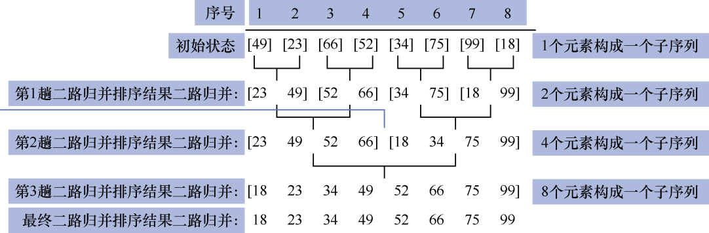
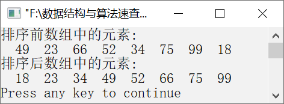

### 二路归并排序


**问题描述**


实现算法，要求使用二路归并排序让元素序列{49,23,66,52,34,75,99,18}按照从小到大的顺序排列。


**【分析】**

二路归并排序的主要算法思想如下。

假设元素的个数是n，将每个元素作为一个有序的子序列，然后将相邻的两个子序列两两合并，得到
个长度为2的有序子序列。继续将相邻的两个有序子序列两两合并，得到个长度为4的有序子序列。以此类推，直到有序序列合并为1个为止。这样，待排序元素序列就整体有序了。

**【示例】**

假设待排序元素序列为{49,23,66,52,34,75,99,18}。使用二路归并排序对该元素序列进行排序的过程如图10.29所示。


<center class="my_markdown"><b class="my_markdown">图10.29　二路归并排序过程</b></center>

初始时，可以将单个元素看作一个有序的子序列，通过将两个相邻的子序列合并，子序列中的元素个数就变成了2。如此不断反复，直到子序列的个数只有一个。这样，待排序元素序列就构成了一个有序的序列。


第10章\实例10-08.cpp

```c
/********************************************
*实例说明：二路归并排序
*********************************************/
1  #include<stdio.h>
2  #include<malloc.h>
3  void CopyArray(int source[], int dest[],int len,int first);
4  void MergeSort(int a[],int left,int right);
5  void Merge(int a[],int left,int right);
6  void DispArray(int a[],int n);
7  void main()
8  {
9     int a[]={49,23,66,52,34,75,99,18};
10    int len=sizeof(a)/sizeof(int);
11    printf("排序前数组中的元素:\n");
12    DispArray(a,len);
13    MergeSort(a,0,len-1);
14    printf("排序后数组中的元素:\n");
15    DispArray(a,len);
16 }
17 void MergeSort(int a[],int left,int right)
18 /*二路归并排序*/
19 {
20    int i;
21    if(left<right)
22    {
23       i=(left+right)/2;
24       MergeSort(a,left,i);
25       MergeSort(a,i+1,right);
26       Merge(a,left,right);
27     }
28 }
29 void Merge(int a[],int left,int right)
30 /*合并两个子序列中的元素*/
31 {
32     int begin1,begin2,mid,k=0,len,*b;
33     begin1=left;
34     mid=(left+right)/2;
35     begin2=mid+1;
36     len=right-left+1;
37     b=(int*)malloc(len*sizeof(int));
38     while(begin1<=mid && begin2<=right)
39     {
40        if(a[begin1]<=a[begin2])
41           b[k++]=a[begin1++];
42        else
43           b[k++]=a[begin2++];
44     }
45     while(begin1<=mid)
46        b[k++]=a[begin1++];
47     while(begin2<=right)
48        b[k++]=a[begin2++];
49     CopyArray(b,a,len,left);
50     free(b);
51 }
52 void CopyArray(int source[], int dest[],int len,int start)
53 /*将source数组中的元素复制到dest数组中，
54 其中，len是源数组长度，start是目标数组起始位置*/
55 {
56     int i,j=start;
57     for(i=0;i<len;i++)
58     {
59         dest[j]=source[i];
60         j++;
61     }
62 }
63 void DispArray(int a[],int n)
64 /*输出数组中的元素*/
65 {
66     int i;
67     for(i=0;i<n;i++)
68         printf("%4d",a[i]);
69     printf("\n");
70 }
```

运行结果如图10.30所示。


<center class="my_markdown"><b class="my_markdown">图10.30　运行结果</b></center>

**【主要用途】**

二路归并排序算法实现复杂。因为二路归并排序算法需要的临时空间较大，所以常常用在外部排序中。

**【稳定性与复杂度】**

二路归并排序是一种稳定排序算法。

二路归并排序需要进行
趟。二路归并排序需要多次递归调用自己，其递归调用的过程可以构成一个二叉树，它的时间复杂度为T(n)n+2T(n/2)n+2(n/2+2T(n/4))= 2n+4T(n/4)3n+8T(n/8)…nlog<sub class="my_markdown">2</sub>n+nT(1)，即O(nlog<sub class="my_markdown">2</sub>n)。

二路归并排序算法的空间复杂度为O(n)。

