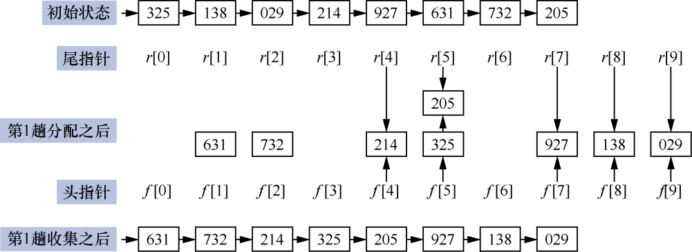
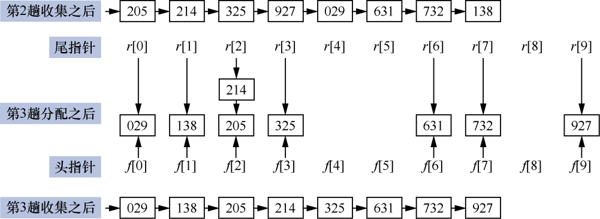
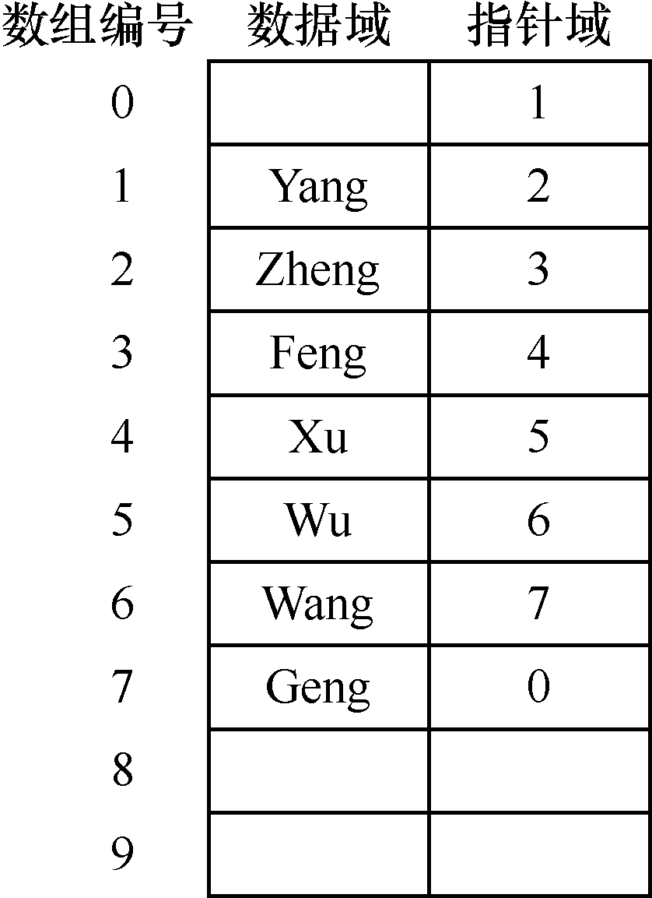
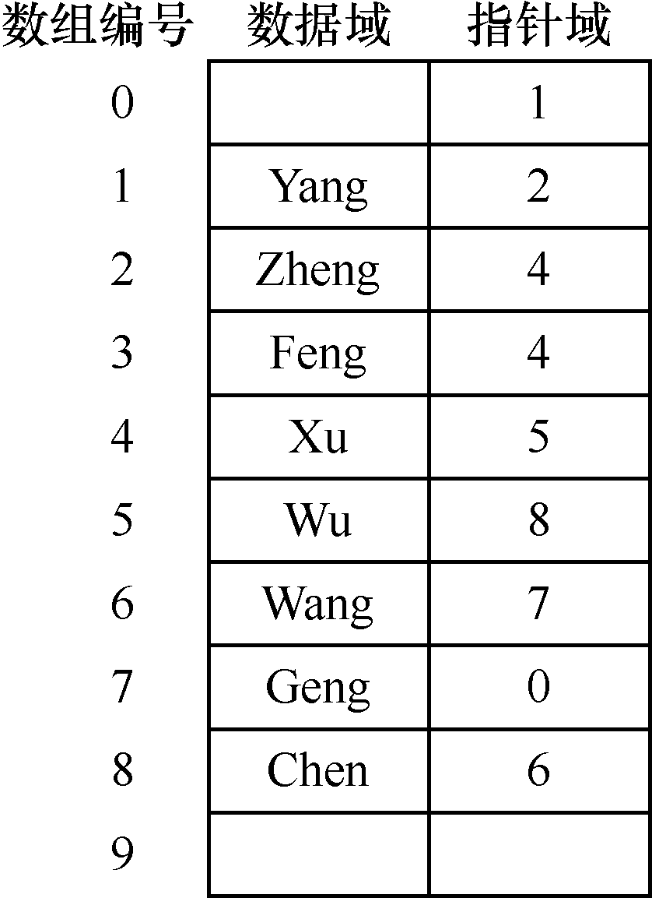
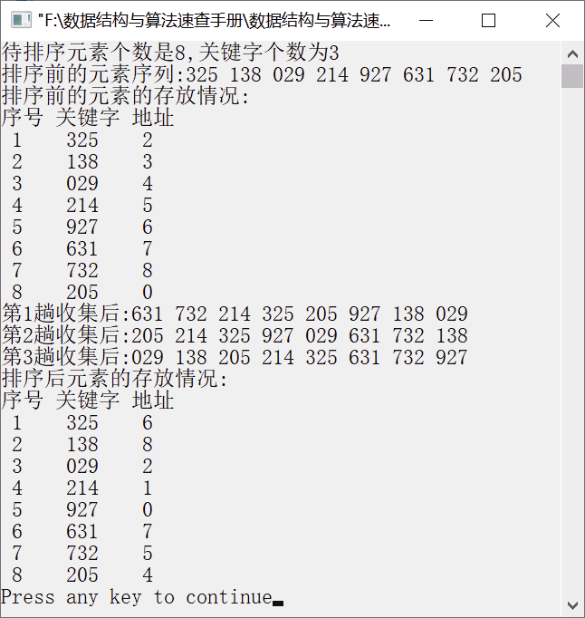

### 基数排序


**问题描述**


已知一个元素序列{325,138,29,214,927,631,732,205}，编写算法，利用基数排序让该元素序列按照从小到大的顺序排列。


**【分析】**

基数排序是一种多关键字排序算法。基数排序将对所有元素根据关键字进行分类，然后按照关键字的顺序将这些元素收集起来，通过这样的方法完成对元素序列的排序。因此，基数排序算法分为两个过程——分配和收集。

具体算法描述如下。

假设第i个元素a<sub class="my_markdown">i</sub>的关键字为key<sub class="my_markdown">i</sub>，key<sub class="my_markdown">i</sub>是由d位十进制数字组成的，即key<sub class="my_markdown">i</sub>=ki<sup class="my_markdown">d</sup>ki<sup class="my_markdown">d</sup><sup>−1</sup>…ki<sup>1</sup>，其中ki<sup>1</sup>为最低位。ki<sup class="my_markdown">d</sup>为最高位，关键字的每一位数字都可作为一个子关键字。将每一个元素依次按照每个关键字进行分配并收集，直到按照所有的元素都分配、收集完毕，这样就完成了排序。

**【示例】**

例如，一个元素序列为{325,138,29,214,927,631,732,205}。这组元素的位数最多是3，在排序之前，首先将所有元素都转换为 3 位数字组成的数，不够 3 位数的在前面添加 0，即{325,138,029, 214,927,631,732,205}。对这组元素进行基数排序需要进行 3趟分配和收集。首先需要对该元素序列的关键字的最低位（即个位）上的数字进行分配和收集，然后对十位数字进行分配和收集，最后对最高位的数字进行分配和收集。一般情况下，采用链表实现基数排序。

对最低位进行分配和收集的过程如图10.31所示。


<center class="my_markdown"><b class="my_markdown">图10.31　对最低位进行分配和收集的过程</b></center>

其中，数组f[i]保存第i个链表的头指针，数组r[i]保存第i个链表的尾指针。

对十位数字进行分配和收集的过程如图10.32所示。


<center class="my_markdown"><b class="my_markdown">图10.32　对十位数字进行分配和收集的过程</b></center>

对最高位进行分配和收集的过程如图10.33所示。


<center class="my_markdown"><b class="my_markdown">图10.33　对最高位进行分配和收集的过程</b></center>

由以上过程很容易看出，经过第1趟分配和收集（即以个位数字作为关键字进行分配后），关键字分为10类，个位数字相同的数字被划分为一类，对分配后的元素进行收集之后，得到以个位数字非递减排列的元素。同理，经过第2趟（即以十位数字为关键字进行分配和收集后），得到以十位数字非递减排列的元素序列。经过第3趟，得到最终的排序结果。

**【存储结构】**

为实现以上算法，可采用静态链表。其中，静态链表可通过一维数组来描述，用游标模拟指针。游标的作用就是指示元素的直接后继。这里游标的数据类型不再是指针类型，而是一个整型。

要实现静态链表，需要通过一个结构体数组描述节点，节点包括两个域——数据域和指针域。数据域用来存放节点的数据信息，指针域指向直接后继元素。静态链表的类型描述如下。

```c
#define ListSize 100
typedef struct
{
    DataType data;
    int cur;
}SListNode;
typedef struct
{
    SListNode list[ListSize];
    int av;
}SLinkList;
```

在以上静态链表的类型定义中，SListNode是一个节点类型，SLinkList是一个静态链表类型，av是备用链表的指针，即av指向静态链表中一个未使用的位置。数组的一个分量（元素）表示一个节点，游标cur代替指针指示节点在数组中的位置。数组的第0个分量可以表示成头节点，头节点的cur指向静态链表中的第一个节点。静态链表中的最后一个节点的指针域为0，指向头节点，这样就构成一个静态循环链表。

例如，线性表(Yang,Zheng,Feng,Xu, Wu,Wang,Geng)采用静态链表存储的情况如图10.34所示。


<center class="my_markdown"><b class="my_markdown">图10.34　静态链表</b></center>

假设s为SLinkList类型变量，则s[0].cur指示第一个节点在数组的位置，如果i=s[0].cur，则s[i].data表示静态链表中的第一个元素，s[i].cur指示第二个元素在数组中的位置。与动态链表的操作类似，游标cur代表指针域，i=s[i].cur表示指针后移，相当于p=p−>next。

**【基本运算】**

（1）静态链表的初始化。

在初始化静态链表时，只需要把静态链表的游标cur指向下一个节点，并将静态链表的最后一个节点的指针域置为0。

```c
SLinkList InitSList(SLinkList L)
/*静态链表的初始化*/
{
    int i;
    for(i=0;i<ListSize;i++)
        L.list[i].cur=i+1;
    L.list[ListSize-1].cur=0;
    L.av=1;
    return L;
}
```

（2）分配节点。

分配节点就是要从备用静态链表中取出一个节点空间，分配给要插入静态链表中的元素，返回值为要插入节点的位置。

```c
int AssignNode(SLinkList L)   
/*分配节点*/
{
    int i;
    i=L.av;
    L.av=L.list[i].cur;
    return i;
}
```

（3）回收节点。

回收节点就是将空闲的节点空间回收，使其成为备用静态链表的空间。

```c
void FreeNode(SLinkList L,int pos)   
/*回收节点*/
{
    L.list[pos].cur=L.av;
    L.av=pos;
}
```

（4）插入操作。

插入操作就是在静态链表中第i个位置插入一个元素。首先从备用链表中取出一个可用的节点，然后将其插入已用静态链表的第i个位置。

例如，要在图10.34所示的静态链表中的第5个元素后插入元素“Chen”，具体步骤如下。

① 为新节点分配一个节点空间，即静态链表的数组编号为8的位置，即k=L.av，同时修改备用指针L.av=L.list[k].cur；

② 在编号为8的位置上插入一个元素“Chen”，即L.list[8].data=“chen”；

③ 修改第5个元素位置的指针域，即L.list[5].cur=L.list[8].cur，L.list[8]. cur=6。

插入结果如图10.35所示。


<center class="my_markdown"><b class="my_markdown">图10.35　插入结果</b></center>

插入操作的算法描述如下。

```c
SLinkList InsertSList(SLinkList L,int i,DataType e)   
/*插入操作*/
{
    int j,k,x;
    k=L.av;
    L.av=L.list[k].cur;
    L.list[k].data=e;
    j=L.list[0].cur;
    for(x=1;x<i-1;x++)
        j=L.list[j].cur;
    L.list[k].cur=L.list[j].cur;
    L.list[j].cur=k;
    return L;
}
```

（5）删除操作。

删除操作就是将静态链表中第i个位置的元素删除。首先找到第（i−1）个元素的位置，修改指针域使其指向第（i＋1）个元素，然后将被删除的节点空间放到备用链表中。

例如，要删除图10.35所示的静态链表中的第3个元素，需要根据游标找到第2个元素，将其指针域修改为第4个元素的位置，即L.list[2].cur=L.list[3].cur。最后要将删除元素的节点空间回收。删除结果如图10.36所示。


<center class="my_markdown"><b class="my_markdown">图10.36　删除结果</b></center>

删除操作的算法描述如下。

```c
SLinkList DeleteSList(SLinkList L,int i)   
/*删除操作*/
{
    int j,k,x;
    if(i==1)
    {
        k=L.list[0].cur;
        L.list[0].cur=L.list[k].cur;
    }
    else
    {
       j=L.list[0].cur;
       for(x=1;x<i-1;x++)
            j=L.list[j].cur;
       k=L.list[j].cur;
       L.list[j].cur=L.list[k].cur;
    }
    L.list[k].cur=L.av;
    L.deldata=L.list[k].data;
    L.av=k;
    return L;
}
```


第10章\实例10-09.cpp

```c
/********************************************
*实例说明：基数排序
*********************************************/
1  #include<stdio.h>
2  #include<malloc.h>
3  #include<stdlib.h>
4  #include<string.h>
5  #include<math.h>
6  #define MaxSize 200                /*待排序元素的最大个数*/
7  #define N 8                        /*待排序元素的实际个数*/
8  #define MaxNumKey 6                /*关键字个数的最大值*/
9  #define Radix 10                   /*关键字基数，10表示十进制数字可以分为10组*/
10 /*静态链表的节点，存放待排序元素*/
11 typedef struct
12 {
13     int key[MaxNumKey];            /*关键字*/
14     int next;
15 }SListCell;    
16 /*静态链表，存放元素序列*/
17 typedef struct
18 {
19     SListCell data[MaxSize];       
20     int keynum;                    
21     int length;                    
22 }SList;                
23 typedef int addr[Radix];           
24 void DispList(SList L);            
25 void DispStaticList(SList L);      
26 SList InitList(SList L,int d[],int n);
27 int Trans(char c);                 /*将字符转换为数字*/
28 voidDistribute(SListCell data[],int i,addr f,addr r);     /*分配*/
29 voidCollect(SListCell data[],addr f,addr r);         /*收集*/
30 SListRadixSort(SList L);           /*基数排序*/
31 void Distribute(SListCell data[],int i,addr f,addr r)
32 /*为data数组中的第i个关键字建立Radix个子表，使同一子表中元素的key[i]相同*/
33 /*f[0，…，Radix-1]和r[0，…，Radix-1]分别指向各个子表中第一个与最后一个元素*/
34 {
35     int j,p;
36     for(j=0;j<Radix;j++)           /*初始化各个子表*/
37         f[j]=0;
38     for(p=data[0].next;p;p=data[p].next)
39     {
40         j=Trans(data[p].key[i]);   /*将关键字转换为数字*/
41         if(!f[j])                  /*若f[j]是空表，则f[j]指示第一个元素*/
42             f[j]=p;
43         else
44             data[r[j]].next=p;
45         r[j]=p;                    
46     }
47 }
48 void Collect(SListCell data[],addr f,addr r)
49 /*收集*/
50 {
51     int j,t;
52     for(j=0;!f[j];j++);            /*找第一个非空子表*/
53     data[0].next=f[j];
54     t=r[j];                        /*r[0].next指向第一个非空子表中的第一个节点*/
55     while(j<Radix-1)
56     {
57         for(j=j+1;j<Radix-1&&!f[j];j++);
58         if(f[j])                   
59         {
60             data[t].next=f[j];
61             t=r[j];
62         }
63      }
64      data[t].next=0;              /*t指向最后一个非空子表中的最后一个节点*/
65 }
66 SList RadixSort(SList L)
67 /*基数排序*/
68 {
69     int i;
70     addr f,r;
71     for(i=0;i<L.keynum;i++)              
72     {
73         Distribute(L.data,i,f,r);        
74         Collect(L.data,f,r);             
75         printf("第%d趟收集后:",i+1);
76         DispStaticList(L);
77     }
78     return L;
79 }
80 void InitList(SList L,int a[],int n)
81 /*初始化静态链表L*/
82 {
83     char ch[MaxNumKey],ch2[MaxNumKey];
84     int i,j,max=a[0];
85     for(i=1;i<n;i++)                     
86         if(max<a[i])
87             max=a[i];
88     L.keynum=(int)(log10(max))+1;        
89     L.length=n;                          
90     for(i=1;i<=n;i++)
91     {
92         itoa(a[i-1],ch,10);              
93         for(j=strlen(ch);j<L.keynum;j++) 
94         {
95             strcpy(ch2,"0");
96             strcat(ch2,ch);
97             strcpy(ch,ch2);
98          }
99          for(j=0;j<L.keynum;j++)        /*将每个元素的各位数存入key，作为关键字*/
100             L.data[i].key[j]=ch[L.keynum-1-j];
101     }
102     for(i=0;i<L.length;i++)            /*初始化静态链表*/
103         L.data[i].next=i+1;
104     L.data[L.length].next=0;
105     return L;
106 }
107 void main()
108 {
109     int d[N]={325,138,29,214,927,631,732,205};
110     SList L;
111     L=InitList(L,d,N);
112     printf("待排序元素个数是%d,关键字个数为%d\n",L. length,L.keynum);
113     printf("排序前的元素序列:");
114     DispStaticList(L);
115     printf("排序前的元素的存放情况:\n");
116     DispList(L);
117     L=RadixSort(L);
118     printf("排序后元素的存放情况:\n");
119     DispList(L);
120 }
121 void DispList(SList L)
122 /*按数组序号形式输出静态链表*/
123 {
124     int i,j;
125     printf("序号  关键字  地址\n");
126     for(i=1;i<=L.length;i++)
127     {
128         printf("%2d    ",i);
129         for(j=L.keynum-1;j>=0;j--)
130             printf("%c",L.data[i].key[j]);
131         printf("    %d\n",L.data[i].next);
132     }
133 }
134 void DispStaticList(SList L)
135 /*按链表形式输出静态链表*/
136 {
137     int i=L.data[0].next,j;
138     while(i)
139     {
140         for(j=L.keynum-1;j>=0;j--)
141             printf("%c",L.data[i].key[j]);
142         printf(" ");
143         i=L.data[i].next;
144     }
145     printf("\n");
146 }
147 int Trans(char c)
148 /*将字符c转化为对应的整数*/
149 {
150     return c-'0';
151 }
```

运行结果如图10.37所示。


<center class="my_markdown"><b class="my_markdown">图10.37　运行结果</b></center>

**【主要用途】**

基数排序算法实现复杂，它是一种多关键字排序算法，属于分配排序。因为基数排序算法不需要过多比较元素，所以在元素较多的情况下，采用基数排序算法的效率要优于前面讲到的排序算法。

**【稳定性与复杂度】**

基数排序是一种稳定的排序算法。

基数排序算法的时间复杂度是O(d(n+r))。其中，n表示待排序的元素个数，d是关键字的个数，r表示基数。一趟分配的时间复杂度是O(n)，一趟收集的时间复杂度是O(r)。

基数排序需要2r个指向链式队列的辅助空间。


