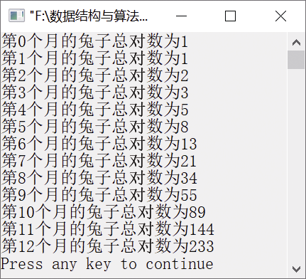
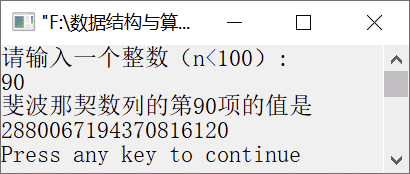

### 11.1.1　斐波那契数列


**问题描述**


如果1对兔子每月能繁殖1对小兔子，而每对兔子在它出生后的第3个月，又能开始繁殖1对小兔子。假定在不发生死亡的情况下，由1对兔子开始，1年后能繁殖成多少对兔子？


**【分析】**

斐波那契数列指的是这样一个数列。

0,1,1,2,3,5,8,13,21,…

这个数列从第3项开始，每一项正好等于前两项之和。如果设F(n)为该数列的第n项，那么斐波那契数列可以写成如下形式。

F(0)=0, F(1)=1, F(n)=F(n−1)+F(n−2) (n
2)

显然，这是一个线性递推数列。

**【分析】**

我们将兔子分为3种——大兔子、1个月大的小兔子、两个月大的小兔子。其中，大兔子指的是已经能繁殖小兔子的兔子，1个月大的兔子是当月繁殖的兔子，两个月大的兔子是上个月繁殖的兔子。到了第3个月，两个月大的兔子就能繁殖小兔子了。具体解决思路如下。

+ 初始时，只有1对初生的小兔子，因此总共有1对。
+ 第1个月时，1个月大的小兔子长成两个月大的小兔子，但还没有繁殖能力。因此，总共有1对。
+ 第2个月时，两个月大的小兔子成为大兔子，已经有繁殖能力，繁殖了1对1个月大的小兔子。因此，总共有两对。
+ 第3个月时，只有1对大兔子又繁殖了1对1个月大的小兔子；同时，上个月繁殖的1月大的小兔子成长为两个月大的小兔子。因此，总共有3对。

以此类推，具体过程如表11.1所示。

<center class="my_markdown"><b class="my_markdown">表11.1　兔子的繁殖过程</b></center>

| 月份 | 大兔子对数 | 1个月大的小兔子对数 | 两个月大的小兔子对数 | 兔子对数 |
| :-----  | :-----  | :-----  | :-----  | :-----  | :-----  | :-----  |
| 初始时 | 0 | 1 | 0 | 1 |
| 1 | 0 | 0 | 1 | 1 |
| 2 | 1 | 1 | 0 | 2 |
| 3 | 1 | 1 | 1 | 3 |
| 4 | 2 | 2 | 1 | 5 |
| 5 | 3 | 3 | 2 | 8 |
| 6 | 5 | 5 | 3 | 13 |
| 7 | 8 | 8 | 5 | 21 |
| 8 | 13 | 13 | 8 | 34 |
| 9 | 21 | 21 | 13 | 55 |
| 10 | 34 | 34 | 21 | 89 |
| 11 | 55 | 55 | 34 | 144 |
| 12 | 89 | 89 | 55 | 233 |

从表11.1不难看出，兔子的总对数分别是1,1,2,3,5,8,13,…，构成一个数列。这个数列正好构成斐波那契数列。

+ 初始时，设f<sub class="my_markdown">0</sub>=1，第0个月兔子的总对数为1。
+ 第1个月时，f<sub class="my_markdown">1</sub>=1，第1个月兔子的总对数为1。
+ 第2个月时，兔子总对数为f<sub>2</sub>=f<sub class="my_markdown">0</sub>+f<sub class="my_markdown">1</sub>。
+ 第3个月时，兔子总对数为f<sub>3</sub>=f<sub class="my_markdown">1</sub>+f<sub>2</sub>。

以此类推，第n个月兔子总对数为f<sub class="my_markdown">n</sub>=f<sub class="my_markdown">n</sub>−2+f<sub class="my_markdown">n</sub>−1。


第11章\实例11-01.c

```c
/********************************************
*实例说明：斐波那契数列
*********************************************/
1  #include<stdio.h>
2  #define N 12
3  void main()
4  {
5      int f[N+1],i;
6      f[0]=1;
7      f[1]=1;
8      for(i=2;i<=N;i++)
9          f[i]=f[i-1]+f[i-2];
10     for(i=0;i<=N;i++)
11         printf("第%d个月的兔子总对数为%d\n",i,f[i]);
12 }
```

运行结果如图11.1所示。


<center class="my_markdown"><b class="my_markdown">图11.1　运行结果</b></center>


斐波那契数列是在中世纪由意大利数学家斐波那契在《算盘全书》中提出的。这个数列的通项公式，除了用a<sub class="my_markdown">n</sub>=a<sub class="my_markdown">n</sub>−2+a<sub class="my_markdown">n</sub>−1表示外，还可以用通项公式表示为。


上面的算法无法获得斐波那契数列的第80项，项数取值超过整型的取值范围时计算机会无法处理。为了表示更大范围的取值，从而输出斐波那契数列的第80项及以后的数据，可用数组存储得到的数据。代码如下。

```c
#include<iostream.h>
#include<iomanip.h>
#define MAXN 100
void main()
{
    int i,j,k,n,p,d,x,a[MAXN],b[MAXN],c[MAXN];
    cout<<"请输入一个整数（n<100）:"<<endl;
    cin>>n;
    p=n/2+1;
    for(i=1;i<=p;i++)
    {
        a[i]=b[i]=c[i]=0;
    }
    a[1]=b[1]=1;
    for(i=3;i<=n;i++)
    {
        d=0;
        for(j=1;j<=p;j++)
        {
            c[j]=a[j]+b[j]+d;
            d=c[j]/10;
            c[j]=c[j]%10;
        }
        for(k=1;k<=p;k++)
        {
            a[k]=b[k];
            b[k]=c[k];
        }
    }
    x=p;
    while(c[x]==0)
        x--;
    cout<<"斐波那契数列的第"<<n<<"项的值是"<<endl;
    for(i=x;i>=1;i--)
        cout<<c[i];
    cout<<endl;
}
```

运行结果如图11.2所示。


<center class="my_markdown"><b class="my_markdown">图11.2　运行结果</b></center>

