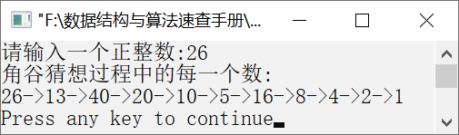

### 11.1.2　角谷猜想


**问题描述**


输入一个正整数，求出角谷猜想过程中的每一个数。


**【定义】**

日本数学家角谷静夫在研究自然数时发现了一个现象：对于任意一个自然数n，如果n为偶数，则将其除以2；如果n为奇数，则将其乘以3，然后再加1。按照以上方法经过有限次运算后，总可以得到自然数1。人们将角谷静夫的这一发现称作“角谷猜想”。

例如，对于自然数21，因为21是奇数，将21乘以3，再加上1，得到64。64是偶数，将64除以2，得到32。因为32是偶数，将32除以2，得到16。如此继续下去，直到得到1。按照角谷猜想，整个过程的数字序列如下。

21→64→32→16→8→4→2→1

**【分析】**

任何一个数的角谷猜想算法步骤如下。

当n不为1时，如果n为偶数，则使n除以2，并用商取代n，输出商；如果n为奇数，则使n乘以3加1取代n，并输出该值；当n为1时，算法结束。


第11章\实例11-02.c

```c
/********************************************
*实例说明：角谷猜想
*********************************************/
1  #include<stdio.h>
2  void main()
3  {
4      int n;
5      printf("请输入一个正整数:");
6      scanf("%d",&n);
7      printf("角谷猜想过程中的每一个数:\n%d",n);
8      while(n!=1)
9      {
10         if(n%2==0)
11         {
12             n/=2;
13             printf("->%d",n);
14         }
15         else
16         {
17             n=n*3+1;
18             printf("->%d",n);
19         }
20     }
21     printf("\n");
22 }
```

运行结果如图11.3所示。


<center class="my_markdown"><b class="my_markdown">图11.3　运行结果</b></center>

