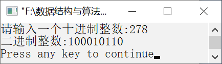

### 11.1.3　将十进制整数转换为二进制整数


**问题描述**


编写算法，输入一个十进制整数，将其转换为二进制整数。


**【分析】**

用除以2取余法。具体步骤如下。

（1）将该数除以2，得到商和余数。

（2）将商作为被除数，并除以2，得到新的商和余数。

（3）重复执行步骤（2），直到商为0为止。将余数反向排列即为所求。


第11章\实例11-03.c

```c
/********************************************
*实例说明：将十进制整数转换为二进制整数
*********************************************/
1  #include<stdio.h>
2  void main()
3  {
4      int i,n,x,a[16];
5      printf("请输入一个十进制整数:");
6      scanf("%d",&x);
7      n=1;
8      while(x!=0)
9      {
10         a[n]=x%2;
11         x=x/2;
12         n++;
13     }
14     printf("二进制整数:");
15     for(i=n-1;i>=1;i--)
16         printf("%d",a[i]);
17     printf("\n");
18 }
```

运行结果如图11.4所示。


<center class="my_markdown"><b class="my_markdown">图11.4　运行结果</b></center>

**【注意事项】**

在算法中，因为x<2<sup class="my_markdown">16</sup>，所以数组a的长度为15，使用下标1～15。

