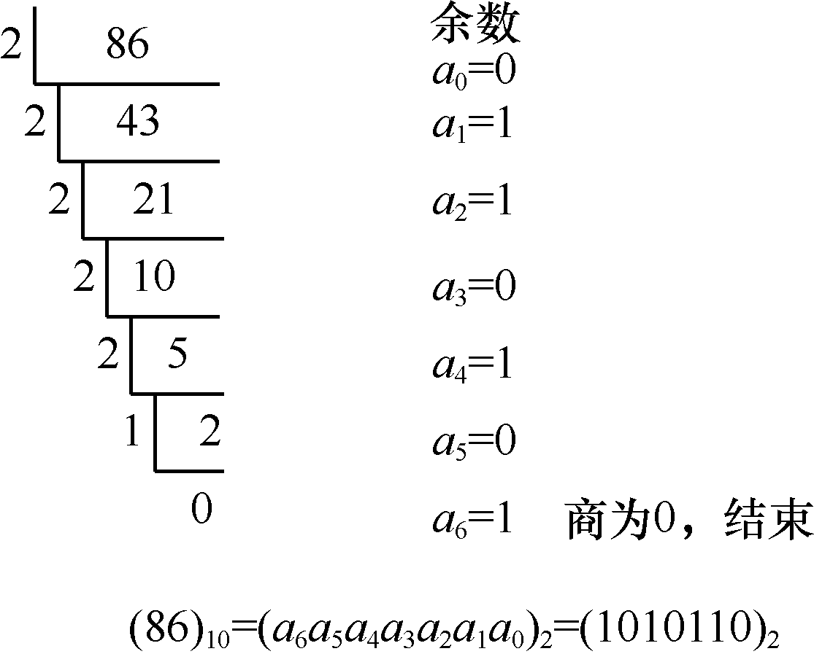
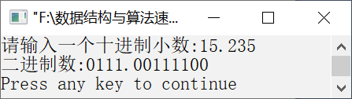

### 11.1.4 　将十进制浮点数转换为二进制数


**问题描述**


实现算法，输入一个十进制浮点数，将其转换为二进制数。


**【分析】**

十进制浮点数可分为整数部分和小数部分，将十进制浮点数转换为二进制数可以分别将整数和小数部分进行转换。其中，将十进制整数转换为二进制整数采用的方法是“除以2取余”，将十进制小数转换为二进制小数采用的方法是“乘以2取整”。

#### 1．除以2取余法──将十进制整数转换为二进制整数

所谓除以2取余法，就是把十进制整数除以2，得到商和余数，并记下该余数。再将商作为被除数除以2，得到新的商和余数，并记下余数。不断地重复以上过程，直到商为0为止。每次得到的余数（0和1）分别对应二进制整数从低位到高位的数字。例如，十进制整数86转换为对应二进制整数的过程如图11.5所示。


<center class="my_markdown"><b class="my_markdown">图11.5　十进制整数86转换为二进制整数的过程</b></center>

#### 2．乘以2取整法──将十进制小数转换为二进制小数

所谓乘以2取整法，就是用2乘以十进制小数，得到一个整数和小数。然后继续使用2乘以小数部分，得到整数部分和小数部分。不断重复下去，直到余下的小数部分为0或者满足一定的精度为止。得到的整数部分依先后次序排列就构成了相应的二进制小数。

例如，十进制小数(0.8125)<sub class="my_markdown">10</sub>转换为二进制小数的过程如图11.6所示。


<center class="my_markdown"><b class="my_markdown">图11.6　十进制小数0.8125转换为二进制小数的过程</b></center>

需要注意的是，在将一个十进制小数转换为对应的二进制小数的过程中，不一定都精确地转换为二进制小数。如果最终的小数部分不能恰好等于0，则只需要满足一定精度即可。

最后将转换后的整数部分和小数部分组合在一起就构成了转换后的二进制数。例如，(86.8125)<sub class="my_markdown">10</sub>=(1010110.1101)<sub>2</sub>。


第11章\实例11-04.c

```c
/********************************************
*实例说明：将十进制浮点数转换为二进制数
*********************************************/
#include<stdio.h>
#include<math.h>
#define N 8
void main()
{
        int a[N+1],b[N+1],i,k=0,value;
        float x;
        double ipart;
        for(i=0;i<=N;i++)
            b[i]=0;
        printf("请输入一个十进制小数:");
        scanf("%f",&x);
        x=modf(x,&ipart);
        value=(int)ipart;
        while(value)
        {
            b[k++]=value%2;
            value/=2;
        }
        for(i=1;i<=N;i++)
        {
            x*=2;
            if(x>=1.0)
            {
                x-=1;
                a[i]=1;
            }
            else
                a[i]=0;
        }
        printf("二进制数:");
        for(i=k;i>0;i--)
            printf("%d",b[i]);
        printf(".");
        for(i=1;i<=N;i++)
        {
            if(a[i]==0)
                printf("0");
            else
                printf("1");
        }
        printf("\n");
}
```

运行结果如图11.7所示。


<center class="my_markdown"><b class="my_markdown">图11.7　运行结果</b></center>

