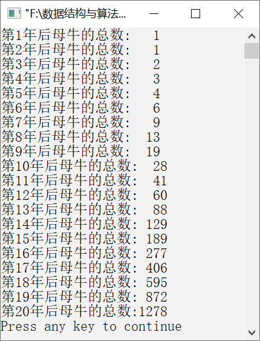

### 11.1.5　母牛生小牛问题


**问题描述**


有一头母牛，每年年初生一头小母牛，每头小母牛从第3年起，每年年初也生一头小母牛。求在第20年时共有多少头母牛。


**【分析】**

令x<sub class="my_markdown">0i</sub>、x<sub>1i</sub>、x<sub>2i</sub>、x<sub>3i</sub>分别表示第i年后刚生下的母牛、满1岁的母牛、满两岁的母牛及可生小母牛的母牛。根据题意，可以得到以下递推公式。

x<sub class="my_markdown">0i</sub> = x<sub>3i</sub>= x<sub>2<em>i−</em>1</sub>+x<sub>3<em>i−</em>1</sub>　　（满两岁、3岁的母牛成为下一年的育龄母牛且都能生下1头小母牛）

x<sub class="my_markdown">11</sub>= x<sub>0<em>i−</em>1</sub> 　　　　　　　（刚生下的小母牛到下一年成为满1岁的小母牛）

x<sub class="my_markdown">2i</sub> = x<sub>1<em>i−</em>1</sub> 　　　　　　　　(满1岁的小母牛到下一年成为满两岁的小母牛)

x<sub class="my_markdown">00</sub>=1

x<sub class="my_markdown">10</sub>= x<sub>20</sub>= x<sub>30</sub>=0 　　　　（初始时，只有一头小母牛）

其中，i=1, 2, 3, …, 20。

初始时，只有一头刚出生的小母牛，因此有x<sub class="my_markdown">00</sub>=1，x<sub>10</sub>=x<sub>20</sub>=x<sub>30</sub>=0；第（i−1）年刚生下的小母牛变为第i年的满1岁小母牛，即x<sub>1i</sub>=x<sub>0(i−1)</sub>；第（i−1）年满1岁的小母牛成为第i年满两岁的小母牛，即x<sub>2i</sub>=x<sub>1(i−1)</sub>；第（i−1）年满两岁和满3岁的小母牛都会在第i年生下小母牛，即x<sub>0i</sub>=x<sub>2(i−1)</sub>+x<sub>3(i−1)</sub>；第（i−1）年满两岁和满3岁的小母牛都成为育龄母牛，即x<sub>3i</sub>=x<sub>2(i−1)</sub>+x<sub>3(i−1)</sub>。


第11章\实例11-05.c

```c
/********************************************
*实例说明：母牛生小牛问题
*********************************************/
1  #include<stdio.h>
2  #define N 20
3  void main()
4  {
5      int x0[N+1],x1[N+1],x2[N+1],x3[N+1],i,s;
6      /*初始时，只有一头刚出生的母牛*/
7      x0[0]=1;
8      x1[0]=x2[0]=x3[0]=0;
9      for(i=1;i<=N;i++)
10     {
11         x0[i]=x3[i]=x2[i-1]+x3[i-1];/*满两岁和满3岁的母牛成为育龄母牛，且都生了小母牛*/
12         x1[i]=x0[i-1];/*刚生下的小母牛成为下一年的满1岁的母牛*/ 
13         x2[i]=x1[i-1];/*满1岁的小母牛成为下一年的满两岁的母牛*/
14         s=x0[i]+x1[i]+x2[i]+x3[i];/*第i年的母牛总数*/
15         printf("第%d年后母牛的总数:%4d\n",i,s);
16     }
17 }
```

运行结果如图11.8所示。


<center class="my_markdown"><b class="my_markdown">图11.8　运行结果</b></center>

