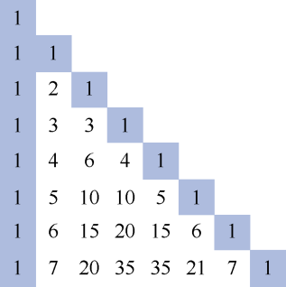
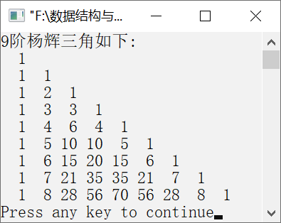

### 11.1.6　输出杨辉三角


**问题描述**


实现算法，要求输出n阶杨辉三角。


**【定义】**

杨辉三角具有二项展开式的二项式系数即组合数的性质，这是研究杨辉三角其他规律的基础。杨辉三角具有以下特性。

（1）每行数字左右对称，由1开始逐渐变大，然后变小，回到1。

（2）第n行的数字个数为n。

（3）第n行数字和为2<sup class="my_markdown">n</sup>−1。

（4）每个数字等于上一行的左右两个数字之和，即
。

（5）第n行的第1个数为1，第2个数为1 (n−1)，第3个数为1(n−1)(n−2)/2，第4个数为[1(n−1)(n−2)/2] (n−3)/3，以此类推。

一个8阶的杨辉三角如图11.9所示。


<center class="my_markdown"><b class="my_markdown">图11.9　8阶的杨辉三角</b></center>

**【分析】**

为了程序设计上的方便，可以使用二维数组存放杨辉三角中的每个元素。初始时，将第1列和对角线上的元素初始化为1，即a[i][0]=a[i][i]=1。然后利用每一行元素值是它上一行两个相邻元素之和求其他部分的元素值，即a[i][j]=a[i−1][j]+a[i−1][j−1]。最后将二维数组中的元素按行输出即可。


第11章\实例11-06.c

```c
/********************************************
*实例说明：杨辉三角
*********************************************/
1  #include<stdio.h>
2  #define N 8
3  void main()
4  {
5      int a[N+1][N+1],i,j;
6      for(i=0;i<=N;i++)
7          a[i][i]=a[i][0]=1;
8      for(i=2;i<=N;i++)
9          for(j=1;j<i;j++)
10             a[i][j]=a[i-1][j]+a[i-1][j-1];
11     printf("%d阶杨辉三角如下:\n",N+1);
12     for(i=0;i<=N;i++)
13     {
14         for(j=0;j<=i;j++)
15             printf("%3d",a[i][j]);
16         printf("\n");
17     }
18 }
```

运行结果如图11.10所示。


<center class="my_markdown"><b class="my_markdown">图11.10　运行结果</b></center>

**【说明】**

杨辉三角中的每一行的数字都符合多项式(a+b)<sup class="my_markdown">n</sup>展开后的各个项的二次项系数的规律。

