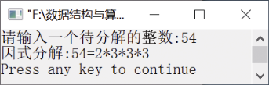

### 11.1.7　质因数分解


**问题描述**


任给一个整数m，编写算法对其进行质因数分解。


**【分析】**

算法步骤如下。

（1）如果m不为1，则从x=2开始。让m除以x，如果能够被整除，则x是其中的一个因子，将x存入数组a中，并用商代替m。

（2）如果m能被x整除，则执行步骤（1）；否则，将x增1。

（3）如果m不为1，则执行步骤（1）；否则，算法结束。

数组a中的元素即为所求。


第11章\实例11-07.c

```c
/********************************************
*实例说明：质因数分解
*********************************************/
1  #include<stdio.h>
2  void main() 
3  { 
4      int a[16],m,m0,x=2,i=0,j;
5      printf("请输入一个待分解的整数:");
6      scanf("%d",&m0);
7      m=m0;
8      while(m!=1)
9      {
10         while(m%x==0)
11         {
12             i++;
13             a[i]=x;
14             m=m/x;
15         }
16         x=x+1;
17     }
18     printf("因式分解:%d=",m0); 
19     for(j=1;j<i;j++)
20         printf("%d*",a[j]);
21     printf("%d",a[i]);
22     printf("\n");
23 }
```

运行结果如图11.11所示。


<center class="my_markdown"><b class="my_markdown">图11.11　运行结果</b></center>

**【说明】**

为了在最后能够输出待分解的整数m，需要定义一个变量m<sub class="my_markdown">0</sub>以保存m。

