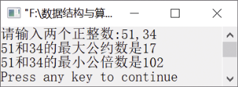

### 11.1.8　求最大公约数和最小公倍数


**问题描述**


任给两个正整数m和n，求最大公约数和最小公倍数。


**【分析】**

利用辗转相除法求最大公约数，然后根据最大公约数得到最小公倍数。辗转相除法求最大公约数的步骤如下。

（1）用m对n求余，余数记作r，即r=m%n。

（2）将除数作为被除数，余数作为除数求新的余数，即m=n，n=r。

（3）重复执行步骤（2），直到余数为0为止，此时的n即为所求。

最小公倍数=mn/最大公约数。


第11章\实例11-08.c

```c
/********************************************
*实例说明：求最大公约数和最小公倍数
*********************************************/
1  #include<stdio.h>
2  void main()
3  {
4      int m,n,m1,n1,r;
5      printf("请输入两个正整数:");
6      scanf("%d,%d",&m,&n);
7      m1=m;
8      n1=n;
9      r=m%n;
10     while(r!=0)
11     {
12         m=n;
13         n=r;
14         r=m%n;
15     }
16     printf("%d和%d的最大公约数是%d\n",m1,n1,n);
17     printf("%d和%d的最小公倍数是%d\n",m1,n1,m1*n1/n);
18 }
```

运行结果如图11.12所示。


<center class="my_markdown"><b class="my_markdown">图11.12　运行结果</b></center>

**【说明】**

在算法中，为了能输出原来的正整数m和n，需要重新定义变量m1和n1，将原来的m和n保存起来。

