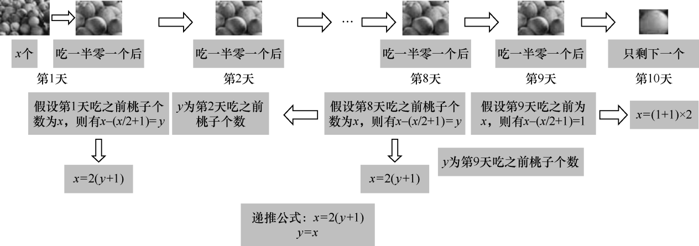
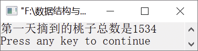

### 11.2.1　猴子摘桃


**问题描述**


猴子第1天摘了若干个桃子，当即吃了一半，还不过瘾，又多吃了一个。第2天早上又将剩下的桃子吃掉一半，又多吃了一个。以后每天早上都吃前一天的“一半零一个”。到第10天早上想再多吃时，发现只剩下一个桃子了。求第1天共摘了多少桃子？


**【分析】**

根据第10天的桃子个数往前推算。第10天只剩下1个桃子，第9天吃了桃子的一半零一个，假设吃第9天吃桃子之前桃子个数为x，则有x−(x/2+1)=1，即x=2×(1+1)。其中，括号中的第1个1表示第10天的桃子个数。接着往前推算，假设第8天吃桃子前桃子有x个，第9天吃桃子前桃子有y个（第9天的桃子个数可以由第10天的桃子个数推算得到），则有x−(x/2+1)=y，即x=2(y+1)。以此类推，可以得到第1天的桃子个数。推算桃子总数的过程如图11.13所示。


<center class="my_markdown"><b class="my_markdown">图11.13　推算桃子总数的过程</b></center>

这个逆推过程可以使用循环实现。


第11章\实例11-09.c

```c
/********************************************
*实例说明：猴子摘桃
*********************************************/
1  #include<stdio.h>
2  void main()
3  {
4      int day,x,y;
5      day=10;
6      y=1;
7      while(day>1)
8      {
9          x=(y+1)*2;
10         y=x;
11         day--;
12     }
13     printf("第一天摘到的桃子总数是%d\n",x);
14 }
```

运行结果如图11.14所示。


<center class="my_markdown"><b class="my_markdown">图11.14　运行结果</b></center>

