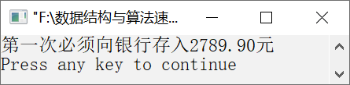

### 11.2.2　存钱问题


**问题描述**


小明为自己的3年研究生生活准备了一笔钱，并一次性存入银行，保证在每年年底取出1 000元，到第3年学习结束时刚好取完。假设银行一年整存零取的月息为0.31%，请计算需要存入银行多少钱？


**【分析】**

这也是一个根据已知结果求已知条件的问题，同样采用逆推法。如果第3年年底连本带息要取出1 000元，则需要先求出第3年年初的银行存款。

假设第3年年初的银行存款是x，则有x(1+0.0031×12)=1000，故x= 1000/(1+0.0031×12)，即第3年年初的银行存款为1000/(1+0.0031×12)。同理，可得到第2年年初的银行存款、第1年年初的银行存款，计算过程如下。

第2年年初的银行存款=(第3年年初的银行存款+1000)/(1+0.0031×12)

第1年年初的银行存款=(第2年年初的银行存款+1000)/(1+0.0031×12)

其中，第1年年初的银行存款就是需要存入银行的存款，这个逆推过程可以使用循环实现。


第11章\实例11-10.c

```c
/********************************************
*实例说明：存钱问题
*********************************************/
1  #include<stdio.h>
2  void main() 
3  { 
4      int i; 
5      float total=0.0; 
6      for(i=0;i<3;i++) 
7      total=(total+1000)/(1+0.0031*12); 
8      printf("第一次必须向银行存入%.2f元\n",total); 
9  }
```

运行结果如图11.15所示。


<center class="my_markdown"><b class="my_markdown">图11.15　运行结果</b></center>


