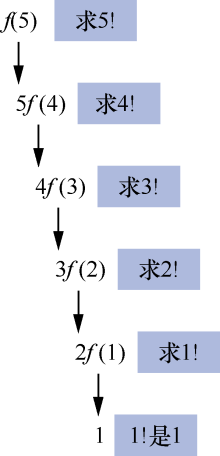
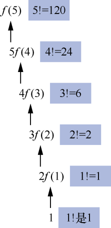
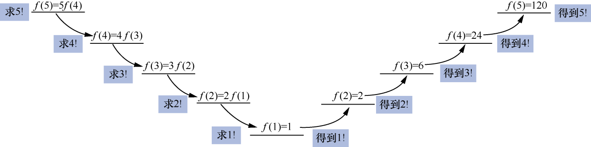
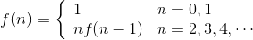
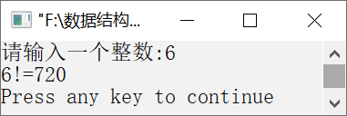

### 12.1.1　求n的阶乘


**问题描述**


通过键盘输入一个整数n，编写算法，输出该整数的阶乘。


【分析】

递归的过程分为两个阶段——回推和递推。回推就是根据要求解的问题找到最基本问题的解，这个过程需要系统栈保存临时变量的值；递推就是根据最基本问题的解得到所求问题的解，这个过程逐步释放系统栈的空间，直到得到问题的解。

求n的阶乘的过程分为回推和递推。

#### 1．回推

求n的阶乘的回推过程如下。

n!=n(n−1)!

(n−1)!=(n−1)(n−2)!

(n-2)!=(n−2)(n−3)!

…

2!=2×1!

1!=1×0!

已知条件：0!=1，1!=1。

例如，求5!的过程如下。

5!=5×4!

4!=4×3!

3!=3×2!

2!=2×1!

1!=1

如果把n！写成函数的形式，即f(n)，则f(5)就表示5!。求5!的过程可以写成如下形式。

f(5)=5f(4)

f(4)=4f(3)

f(3)=3f(2)

f(2)=2f(1)

f(1)=1

从上面的过程可以看出，求f(5)需要调用函数f(4)，求f(4)需要调用f(3)。以此类推，求f(2)需要调用f(1)。其中，f(5)、f(4)、f(3)、f(2)、f(1)都会调用同一个函数f，只是参数不同而已。上面的回推过程如图12.1所示。


<center class="my_markdown"><b class="my_markdown">图12.1　求5!的回推过程</b></center>

#### 2．递推

根据f(1)=1这个最基本的已知条件，得到2!、3!、4!、5!，这个过程称为递推。由递推可以得到最终的结果，如图12.2所示。


<center class="my_markdown"><b class="my_markdown">图12.2　求5!的递推过程</b></center>

综上所述，回推的过程是将一个复杂的问题变为一个最简单的问题，递推的过程是由最简单的问题的解得到复杂问题的解。

求5!的递归函数调用的完整过程如图12.3所示。


<center class="my_markdown"><b class="my_markdown">图12.3　求5!的递归函数调用的完整过程</b></center>

**【算法描述】**

通过以上分析可知，当n=0或n=1时，f(n)=1；否则，f(n)=nf(n−1)。因此，求n的阶乘f(n)可写成如下公式。



其实，这就是一个递归定义的公式。


第12章\实例12-01.c

```c
/********************************************
*实例说明：求n的阶乘
*********************************************/
1  #include<stdio.h>
2  long int Fact(int n);
3  void main()
4  {
5      int n;
6      printf("请输入一个整数:");
7      scanf("%d",&n);
8      printf("%d!=%d\n",n,Fact(n));
9  }
10 long int Fact(int n)
11 {
12     int x;
13     long int y;    
14     if(n < 0)                      
15     {
16         printf("参数错!");
17         return -1;    
18     }
19     if(n == 0)                    
20         return 1;
21     else
22     {
23         return n*Fact(n - 1);    
24     }
25 }
```

运行结果如图12.4所示。


<center class="my_markdown"><b class="my_markdown">图12.4　算法运行结果</b></center>


（1）函数f是递归函数，它的作用是求n的阶乘。从函数f的实现来看，它与f(n)的递归公式没有什么区别，只是将条件变为了用C语言描述的if语句。需要注意的是，因为这个函数需要有返回结果，所以在if语句中，必须使用return语句。

①在递归函数中，必须要有一个结束递归过程的条件，即递归的出口。在该程序中，n==0||n==1就是结束递归过程的条件。这也是求递归问题中的一个已知基本问题的解，即最小问题的解。

②在递归函数f的实现中，函数类型为long型，而不是int型。这主要是因为n的阶乘的值比较大，long型能容纳更大范围的数据。

③递归就是自己调用自己。一个函数在定义时直接或间接地调用自身，这样的函数称为递归函数。它通常将一个复杂的问题转化为一个与原问题相似且规模较小的问题来求解。

（2）递归函数中的局部变量和参数只局限于当前调用层。当进入下一层时，上一层的参数和局部变量被屏蔽。


