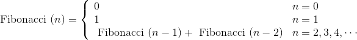
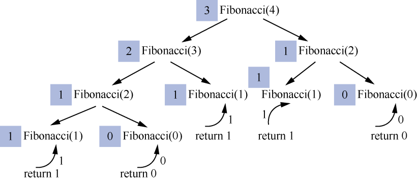
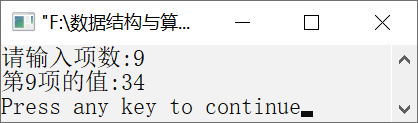

### 12.1.2　斐波那契数列


**问题描述**


我们把形如0,1,1,2,3,5,8,13,21,34,55,89,…的数列称为斐波那契数列。不难发现，从第3个数起，每个数都是前两个数之和。编写算法，输出斐波那契数列的前n项。


**【分析】**

斐波那契数列可以写成如下公式。



当n=4时，求Fibonacci(4)的值的过程如图12.5所示。


<center class="my_markdown"><b class="my_markdown">图12.5　求Fibonacci(4)的值的过程</b></center>

图中的阴影部分是右边的函数的对应值。求Fibonacci(4)的值，需要先求出Fibonacci(2)与Fibonacci(3)的值；而求Fibonacci(3)的值，需要先求出Fibonacci(1)与Fibonacci(2)的值；依次类推，直到求出Fibonacci(1)和Fibonacci(0)的值。因为当n=0和n=1时，Fibonacci(0)=0，Fibonacci(1)=1，所以直接将1和0返回。Fibonacci(0)=0和Fibonacci(1)=1就是Fibonacci(4)的基本问题的解。同理，Fibonacci(n)（n
2）也是根据这个基本问题的解得到的。当回推到n=0或n=1时，开始递推，直到求出Fibonacci(4)的值。最后，Fibonacci(4)的值为3。求Fibonacci(n)的过程与此类似。


第12章\实例12-02.c

```c
/********************************************
*实例说明：斐波那契数列
*********************************************/
1  #include<stdio.h>
2  int fib(int n);
3  void main()
4  {
5      int n;
6      printf("请输入项数:");
7      scanf("%d",&n);
8      printf("第%d项的值:%d\n",n,fib(n));
9  }
10 int fib(int n)
11 {
12     if (n==0)
13         return 0;
14     if (n==1)
15         return 1;
16     if (n>1)
17         return fib(n-1)+fib(n-2);
18 }
```

运行结果如图12.6所示。


<center class="my_markdown"><b class="my_markdown">图12.6　运行结果</b></center>

