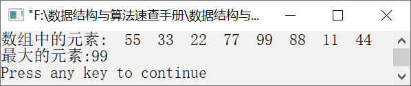

### 12.1.3　求n个元素中的最大者


**问题描述**


求元素序列{55,33,22,77,99,88,11,44}中的最大者。


**【分析】**

假设元素序列存放在数组a中，数组a中n个元素的最大者findmax(a, n)可以通过将a[n−1]与前（n−1）个元素最大者比较之后得到。当n=1时，findmax(a,n)=a[0]；当n>1时，findmax(a,n)= (a[n−1]> findmax(a,n−1)?a[n−1]:findmax(n−1)。

也就是说，数组a中只有一个元素时，最大者是a[0]；超过一个元素时，则要比较最后一个元素a[n−1]和前（n−1）个元素中的最大者，其中较大的一个即是所求。而前（n−1）个元素的最大者需要继续调用findmax函数。


第12章\实例12-03.c

```c
/********************************************
*实例说明：求n个元素中的最大者
*********************************************/
1  #include<stdio.h>
2  int findmax(int a[],int n);
3  void main()
4  {
5      int a[]={55,33,22,77,99,88,11,44},n,i;
6      n=sizeof(a)/sizeof(a[0]);
7      printf("数组中的元素:");
8      for(i=0;i<n;i++)
9          printf("%4d",a[i]);
10     printf("\n最大的元素:%d\n",findmax(a,n));
11 }
12 int findmax(int a[],int n)
13 {
14     int m;
15     if(n<=1)
16         return a[0];
17     else
18     {
19         m=findmax(a,n-1);
20         return a[n-1]>=m?a[n-1]:m;
21     }
22 }
```

运行结果如图12.7所示。


<center class="my_markdown"><b class="my_markdown">图12.7　运行结果</b></center>

**【说明】**

findmax(a,1)=a[0]就是基本问题的解，这是递归函数的已知条件。当n>1时，findmax函数通过这个已知条件不断递归得到所求问题的解。

