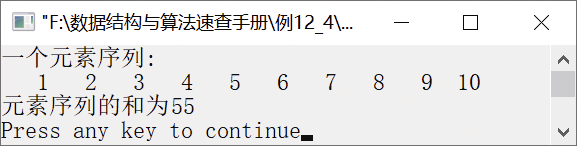

### 12.1.4　求n个数的和


**问题描述**


求序列{1,2,3,4,5,6,7,8,9,10}中元素的和。


**【分析】**

该题与前面求n个数的最大者算法思想类似。假设n个元素存放在数组a中，求n个数的和就是求第n个数与前（n−1）个数的和，这样就将求n个数和的问题分解为求前（n−1）个数的和的问题。当n<1时，n个数的和就是a[0]，即返回a[0]；当n>1时，前n个数的和就等于a[n−1]+AddFunc(a,n-1)。其中，AddFunc(a,n−1)表示求数组a中前（n−1）个数的和的函数。


第12章\实例12-04.c

```c
/********************************************
*实例说明：求n个数的和
*********************************************/
#include<stdio.h>
int AddFunc(int a[],int n);
void main()
{
    int a[]={1,2,3,4,5,6,7,8,9,10},n,i;
    n=sizeof(a)/sizeof(a[0]);
    printf("一个元素序列:\n");
    for(i=0;i<n;i++)
        printf("%4d",a[i]);
    printf("\n");
    printf("元素序列的和为");
    printf("%d\n",AddFunc(a,n));
}
int AddFunc(int a[],int n)
{
    if(n<=1)
        return a[0];
    return a[n-1]+AddFunc(a,n-1);
}
```

运行结果如图12.8所示。


<center class="my_markdown"><b class="my_markdown">图12.8　运行结果</b></center>

**【说明】**

当n
1时，return a[0]就是基本问题的解，这是递归函数的结束条件。当n>1时，通过不断调用AddFunc(a,n-1)函数求解前（n−1）个数的和。

