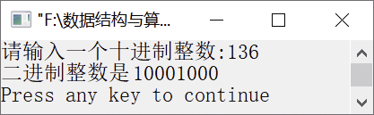

### 12.1.5　将十进制整数转换为二进制整数


**问题描述**


使用递归函数将十进制整数转换为二进制整数。


**【分析】**

使用除以2取余法，不断地将商作为新的被除数除以2，而每次得到的余数序列就是所求的二进制整数。函数DectoBin的定义如下。

```c
void DectoBin(int num)
```

当num==0时，回推阶段结束，开始递推，并返回；否则，将商作为新的被除数，即调用函数DectoBin(num/2)，同时输出每层的余数，即printf("%d",num%2)。


第12章\实例12-05.c

```c
/********************************************
*实例说明：将十进制整数转换为二进制整数
*********************************************/
1  #include<stdio.h>
2  void DectoBin(int num);
3  void main()
4  {
5      int n;
6      printf("请输入一个十进制整数:");
7      scanf("%d",&n);
8      printf("二进制数是");
9      DectoBin(n);
10     printf("\n");
11 }
12 void DectoBin(int num)
13 {
14     if(num==0)
15        return;
16     else
17     {
18        DectoBin(num/2);
19        printf("%d",num%2);
20     }
21 }
```

运行结果如图12.9所示。


<center class="my_markdown"><b class="my_markdown">图12.9　运行结果</b></center>

**【说明】**

+ 因为当商为0时，递推阶段结束，需要停止递推，也不需要返回值，所以只需要一个空的返回语句即return。
+ 为了将商作为新的被除数，需要将num/2作为参数传递给函数DectoBin，同时输出余数，即num%2。

