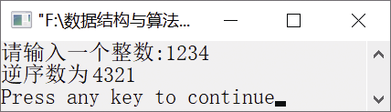

### 12.1.6　求整数的逆序数


**问题描述**


实现递归算法，输入一个整数，输出该整数的逆序数。例如，输入1234，则输出4321。


**【分析】**

设输入的整数为n。为了输出n的逆序数，可利用n对10取余，得到末位数，存放到数组a[]中。然后将n除以10，得到新的整数n，再对10取余，存放到数组a[]中。这个过程可利用递归函数实现，参数为n/10，递归出口为n
0。


第12章\实例12-06.c

```c
/********************************************
*实例说明：求整数的逆序数
*********************************************/
#include<stdio.h>
#include<malloc.h>
#define N 20
int a[N],i=0;
void RevNum(int n)
{
   if(n > 0)                 //判断该数是否大于0
   {
       printf("%d", n%10);   //输出末位数
       a[i++]=n%10;
       RevNum(n/10); 
   }
}
int LenNum(int n)
{
    int c=0;
    while(n)
    {
        n/=10;
        c++;
    }
    return c;
}
void main()
{
    int n,len,i;
    printf("请输入一个整数:");
    scanf("%d",&n);
    len=LenNum(n);
    RevNum(n);
    printf("逆序数为");
    for(i=0;i<len;i++)
        printf("%d",a[i]);
    printf("\n");
}
```

运行结果如图12.10所示。


<center class="my_markdown"><b class="my_markdown">图12.10　运行结果</b></center>

