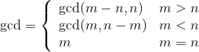
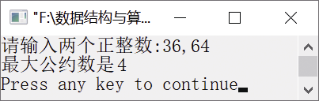

### 12.1.7　求最大公约数


**问题描述**


用递归函数求两个整数m和n的最大公约数。


**【分析】**

两个整数m和n的最大公约数gcd具有以下性质。



用C语言描述如下。

```c
if(m>n)
    return gcd(m-n,n);
else if(m<n)
    return gcd(m,n-m);
else
    return m;
```


第12章\实例12-07.c

```c
/********************************************
*实例说明：求最大公约数
*********************************************/
1  #include<stdio.h>
2  int gcd(int m,int n);
3  void main()
4  {
5      int m,n;
6      printf("请输入两个正整数:");
7      scanf("%d,%d",&m,&n);
8      printf("最大公约数是%d\n",gcd(m,n));
9  }
10 int gcd(int m,int n)
11 {
12     if(m>n)
13         return gcd(m-n,n);
14     else if(m<n)
15         return gcd(m,n-m);
16     else
17         return m;
18 }
```

运行结果如图12.11所示。


<center class="my_markdown"><b class="my_markdown">图12.11　运行结果</b></center>

**【说明】**

这种不断相减的方法与辗转相除法本质上是一样的，都是在寻找m和n公用的部分。

