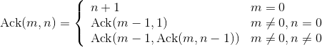
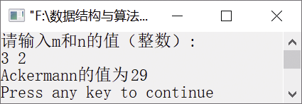

### 12.1.8　求Ackermann函数的值


**问题描述**


Ackermann函数的定义如下。



要求编写以上函数的递归算法，当输入m和n时，求Ackermann函数的值。


第12章\实例12-08.cpp

```c
/********************************************
*实例说明：求Ackermann函数的值
*********************************************/
#include<iostream.h>
int Ackermann(int m, int n);
void main()
{
    int m,n,s;
    cout<<"请输入m和n函数的值（整数）"<<endl;
    cin>>m>>n;
    s=Ackermann(m,n);
    cout<<"Ackermann函数的值为"<<s<<endl;
}
int Ackermann(int m,int n)
{
    if (m==0)
        return n+1;
    else if (n==0)
        return Ackermann(m-1,1);
    else
        return Ackermann(m-1,Ackermann(m,n-1));
}
```

运行结果如图12.12所示。


<center class="my_markdown"><b class="my_markdown">图12.12　运行结果</b></center>

