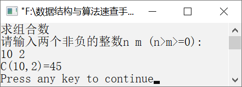

### 12.1.9　求C (n,m)的值


**问题描述**


C(n,m)的定义如下。


要求实现以上函数的递归算法，当输入m和n时，求C(n,m)的值。


第12章\实例12-09.cpp

```c
/********************************************
*实例说明：求C(n,m)的值
*********************************************/
#include<iostream.h>
int Comb(int n, int m);
void main()
{
    int n,m;
    cout<<"求组合数"<<endl;
    cout<<"请输入两个非负的整数n m (n>m>=0):"<<endl;
    cin>>n>>m;
    cout<<"C("<<n<<","<<m<<")="<<Comb(n,m)<<endl;
}
int Comb(int n, int m)
{
    if(n==m || m==0)
        return 1;
    else if(n>m && m>0)
        return Comb(n-1,m)+Comb(n-1,m-1);
}
```

运行结果如图12.13所示。


<center class="my_markdown"><b class="my_markdown">图12.13　运行结果</b></center>

