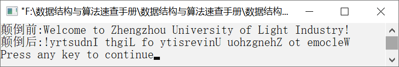

### 12.2.1　逆置字符串


**问题描述**


编写递归算法，不占用额外的存储空间，将一个字符串就地逆置，并重新存放在原字符串中。


**【分析】**

假设字符串存放在字符数组s中，递归函数原型如下。

```c
int RevStr(char s[],int i);
```

为逆置当前位置的字符，需要先求出逆置后当前字符在字符串中的存放位置。递归函数首先将当前位置的字符读取到一个变量ch中。若当前位置的字符是字符串结束符，函数返回0，并告知上次的递归调用函数，最末字符应存放到字符串的首位置。代码如下。

```c
    char ch=s[i];
    if(ch=='\0')
        return 0;
```

对于其他情况，函数以s和字符位置i+1作为参数递归调用函数RevStr，求得当前字符的存放位置k，并将字符存放在位置k中。同时，下一个位置用来存放前一个字符。代码如下。

```c
  k=RevStr(s,i+1);
  s[k]=ch;
  return k+1;
```

综合以上两种情况，可以很容易写出逆置字符串的递归函数。


第12章\实例12-10.c

```c
/********************************************
*实例说明：逆置字符串
*********************************************/
1  #include<stdio.h>
2  int RevStr(char s[],int i);
3  void main()
4  {
5      char s[]="Welcome to Northwest University!";
6      printf("颠倒前:%s\n",s);
7      RevStr(s,0);
8      printf("颠倒后:%s\n",s);
9  }
10 int RevStr(char s[],int i)
11 {
12     int k;
13     char ch=s[i];
14     if(ch=='\0')
15        return 0;
16     else
17     {
18        k=RevStr(s,i+1);
19        s[k]=ch;
20        return k+1;
21     }
22 }
```

运行结果如图12.14所示。


<center class="my_markdown"><b class="my_markdown">图12.14　运行结果</b></center>

**【说明】**

（1）条件ch=='\0'实际上就是递归函数的出口，返回0表示已经到了字符串的结束位置，应将前一个字符即最末一个字符存放在第0个位置。

（2）在其他情况下，不断递归调用函数RevStr，返回值k就是当前字符应存放的位置。每一层递归调用函数的返回值为k+1（从前往后），表示依次将递归调用返回的字符ch（从后往前）存放在相应的位置。

