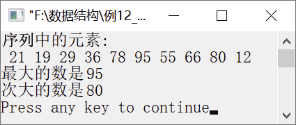

### 12.2.2　求最大和次大元素


**问题描述**


已知有n个元素的无序序列，要求编写一个算法，求该无序序列中的最大和次大元素。


**【分析】**

对于无序序列a[low, …, high]，可采用分而治之的方法（即将问题规模缩小为k个子问题加以解决）求最大和次大元素。该问题可分为以下几种情况。

+ 若无序序列a[low, …, high]中只有一个元素，则最大元素为a[low]，次大元素为−32768。
+ 若无序序列a[low, …, high]中有两个元素，则最大元素为a[low]和a[high]中的较大者，次大元素为较小者。
+ 若无序序列a[low, …, high]中元素个数超过2，则从中间位置mid=(low+high)/2将该无序序列分为两区间——a[low, …, mid]和a[mid+1, …, high]。然后分别通过递归调用的方式得到两个区间中的最大元素和次大元素。其中，从左边区间求出的最大元素与次大元素分别存放在lmax1和lmax2中，从右边区间求出的最大元素和次大元素分别存放在rmax1和rmax2中。若lmax1>rmax1，则最大元素为lmax1，次大元素为lmax2和rmax1中的较大者；若lmax
+ rmax1，则最大元素为rmax1，次大元素为lmax1和rmax2中的较大者。


第12章\实例12-11.c

```c
/********************************************
*实例说明：求最大和次大元素
*********************************************/
1  #include<iostream.h>
2  #include<iomanip.h>
3  #define MIN -32768
4  void MaxMinNum(int a[],int low,int high,int *max,int *min);
5  void main()
6  {
7      int a[]={21,19,29,36,78,95,55,66,80,12},n,low,high,max,min,i;
8      n=sizeof(a)/sizeof(a[0]);
9      cout<<"序列中的元素:"<<endl;
10      for(i=0;i<n;i++)
11          cout<<setw(3)<<a[i];
12      cout<<endl;
13      low=0;
14      high=n-1;
15      max=min=a[0];
16      MaxMinNum(a,low,high,&max,&min);
17      cout<<"最大的数是"<<max<<endl;
18      cout<<"次大的数是"<<min<<endl;
19  }
20  void MaxMinNum(int a[],int low,int high,int *max1,int *max2)
21  {
22      int mid,lmax1,lmax2,rmax1,rmax2;
23      if(low==high)
24      {
25          *max1=a[low];
26          *max2=MIN;
27      }
28      else if(low==high-1)
29      {
30          *max1=a[low]>a[high]?a[low]:a[high];
31          *max2=a[low]>a[high]?a[high]:a[low];
32      }
33      else
34      {
35          mid=(low+high)/2;
36          MaxMinNum(a,low,mid,&lmax1,&lmax2);
37          MaxMinNum(a,mid+1,high,&rmax1,&rmax2);
38          if(lmax1>rmax1)
39          {
40              *max1=lmax1;
41              *max2=lmax2>rmax1?lmax2:rmax1;
42          }
43          else
44          {
45              *max1=rmax1;
46              *max2=lmax1>rmax2?lmax1:rmax2;
47          }
48      }
49  }
```

运行结果如图12.15所示。


<center class="my_markdown"><b class="my_markdown">图12.15　运行结果</b></center>

**【说明】**

第 23～27 行中，若无序序列a[low, …, high]中只有一个元素，则a[low]为最大元素并赋给max1，MIN为次大元素并赋给max2。

第28～32行中，若无序序列a[low, …, high]中只有两个元素，则将较大的赋给max1，较小的赋给max2。

第33～37行中，若无序序列a[low, …, high]中元素个数超过两个，则先从中间位置将该无序序列分为两个区间，然后递归调用函数MaxMinNum(a,low,mid,&lmax1,&lmax2)和MaxMinNum(a,mid+1, high, &rmax1,&rmax2)，分别求出左半区间与右半区间中的最大和次大元素，分别存在lmax1和lmax2以及rmax1和rmax2中。

第38～42行中，若lmax1>rmax1，则最大元素为lmax1，将其赋给max1，并从lmax2和rmax1中找出较大者，将其赋给max2。

第43～47行中，若lmax1
rmax1，则最大元素为rmax1，将其赋给max1，并从rmax2和lmax1中找出较大者，将其赋给max2。

