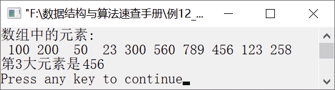

### 12.2.3　求无序序列中第k大的元素


**问题描述**


给定n个无序的元素，要求编写一个递归算法，求该序列中第k大的元素。


**【分析】**

该题也可以像求最大和次大元素一样利用分而治之的算法思想求解。具体地，可利用快速排序的思想，通过确定某个子序列的枢轴元素pos，将这些元素分成若干个子区间，并不断缩小子区间直至区间中只有一个元素。假设这些无序元素存放在数组a中，确定子区间的划分位置分为以下几种情况。

+ 如果枢轴元素pos=n−k（其中n是无序元素的长度），则表明找到了第k大的元素，返回该元素。
+ 如果pos> n − k，那么第k大的元素一定在子区间a[0]～a[pos − 1]内，继续在该子区间查找即可。
+ 如果pos< n − k，那么第k大的元素一定在子区间a[pos+1]～a[n − 1]内，继续在该子区间查找即可。

具体在划分子区间时，即确定枢轴元素的位置时，利用快速排序算法分别从区间的第一个元素和最后一个元素开始，分别与枢轴元素进行比较。若遇到a[high]<a[pos]且a[low]>a[pos]，则将两个元素交换。以此类推，直至high
low。最后将a[pos]放置在a[low]的位置上，这样a[pos]就将该区间划分为左右两个子区间，左边的子区间元素值均小于a[pos]，右边的子区间元素值均大于或等于a[pos]。


第12章\实例12-12.c

```c
/********************************************
*实例说明：求无序序列中第k大的元素
*********************************************/
#include<stdio.h>
#include<iostream.h>
#include<iomanip.h>
int Partition(int a[],int low ,int high);
int Find_K_Largest(int a[],int low, int high,int n ,int k);
int Partition(int a[],int low ,int high)
//以low为枢轴元素划分子区间
  {
    int t = a[low];
    while(low < high)
    {
        while(low < high && a[high] >= t)
            high--;
        a[low] = a[high];
        while(low < high && a[low] <= t)
            low++;
        a[high] = a[low];
    }
    a[low] = t; 
    return low;
 }
int Find_K_Largest(int a[],int low, int high,int n ,int k)
{
    int pos;
    if(a == NULL || low >= high || k > n) 
        return 0;
    pos = Partition(a,low,high);         
    while(pos != n  - k)
    {
        if(pos > n - k)
        {
            high = pos - 1;
            pos = Partition(a,low,high);  
        }
        if(pos < n - k)
        {
            low = pos + 1;
            pos = Partition(a,low,high);  
       }
    }
    return arr[pos];
}
 void main()
 {
     int a[]={100,200,50,23,300,560,789,456,123,258},i,first,last,n,k;
     n=sizeof(a)/sizeof(a[0]);
     first=0;
     last=n-1;
     k=3;
     cout<<"数组中的元素"<<endl;
     for(i=0;i<n;i++)
         cout<<setw(4)<<a[i];
     cout<<endl;
     cout<<"第"<<k<<"大元素是";
     cout<<Find_K_Largest(a,first,last,n,k)<<endl;
 }
```

运行结果如图12.16所示。


<center class="my_markdown"><b class="my_markdown">图12.16　运行结果</b></center>

