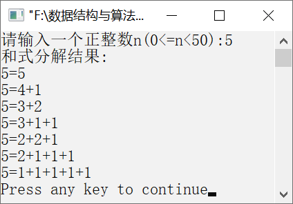

### 12.2.4　和式分解


**问题描述**


实现一个递归函数，要求给定一个正整数i，输出和为i的所有非递增的正整数和式。例如，若i=5，则输出的和式结果如下。


```c
5=5
5=4+1
5=3+2
5=3+1+1
5=2+2+1
5=2+1+1+1
5=1+1+1+1+1
```

**【分析】**

这是2009年中国人民银行考研的笔试题目。引入数组a，用来存放分解出来的和数。其中，a[k]存放第k步分解出来的和数。递归函数应设置3个参数：第1个参数是数组名a，用来将数组中的元素传递给被调用函数；第2个参数（i）表示本次递归调用要分解的数；第3个参数（k）是本次递归调用将要分解出的第k个和数。递归函数的原型如下。

```c
 void rd(int a[],int i,int k)
```

对将要分解的数i，可分解出的和数j共有i种可能，它们是i, i−1,…, 2, 1。但为了保证分解出来的和数依次构成不增的正整数序列，要求从i分解出来的和数j不能超过a[k−1]，即上次分解出来的和数。

特别地，为保证对第一步（k=1）的分解也成立，算法可在a[0]预置n，即第一个和数最大为n。在分解过程中，当分解出来的和数j等于i时，说明已完成一个和式分解，应将和式输出；当分解出来的和数j<i时，说明还有i−j需要进行第k+1次分解。


第12章\实例12-13.c

```c
/********************************************
*实例说明：和式分解
*********************************************/
1  #include<stdio.h>
2  #define N 50
3  void rd(int a[],int i,int k);
4  void main()
5  {
6      int n,a[N];
7      printf("请输入一个正整数n(0<=n<50):");
8      scanf("%d",&n);
9      a[0]=n;
10     printf("和式分解结果:\n");
11     rd(a,n,1);
12 }
13 void rd(int a[],int i,int k)
14 {
15     int j,p;
16     for(j=i;j>=1;j--)
17     {
18         if(j<=a[k-1])
19         {
20            a[k]=j;
21            if(j==i)
22            {
23               printf("%d=%d",a[0],a[1]);
24               for(p=2;p<=k;p++)
25                   printf("+%d",a[p]);
26               printf("\n");
27            }
28            else
29               rd(a,i-j,k+1);
30        }
31     }
32 }
```

运行结果如图12.17所示。


<center class="my_markdown"><b class="my_markdown">图12.17　运行结果</b></center>

**【说明】**

第16行中，循环语句表示待分解的数的范围为从i到1。

第18行中，表示如果当前待分解的和数j小于已经分解的和数a[k−1]，这是为了保证分解出的和数按照不增的顺序排列。

第20行中，将当前的待分解的和数j存放到序号为k的数组位置。

第21～27行中，如果j等于i，则表示已完成一个和式分解，输出该和式。

第28～29行中，将还未分解的数i−j和分解的和数次数k传递给rd函数进行递归调用求解。

