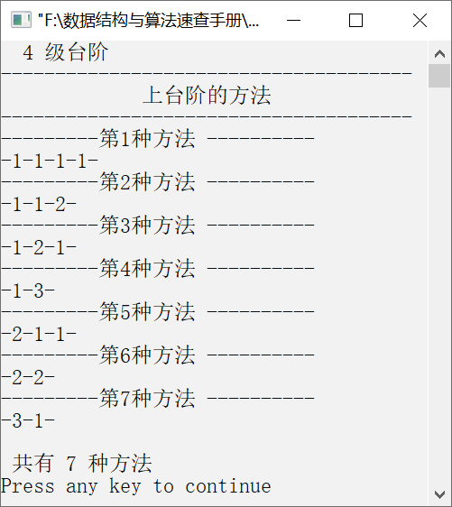

### 12.2.5　台阶问题


**问题描述**


某人上台阶，一次可以上1级台阶、2级台阶或3级台阶，共有n级台阶。编程输出他所有可能的上台阶法。例如，有4级台阶，输出结果如下。


```c
1    1    1    1
1    1    2
1    2    1
1    3
2    1    1
2    2
3    1
```

**【分析】**

由题意可知，可以将问题分成3种情况，分别是一次上1级台阶、一次上2级台阶、一次上3级台阶。在递归函数中，需要引入一个参数n，用来表示每次上多少级台阶。函数原型如下。

```c
void step(int n);
```

用数组queue存放每次上的台阶级数。如果上1级台阶，则将1存放到数组queue中，代码如下。

```c
  queue[index++]=1;
  step(n-1);
  --index;
```

如果上两级台阶，则将2存放到数组queue中，代码如下。

```c
  if (n>1)
  {
      queue[index++]=2;
      step(n-2);
      --index;
  }
```

如果上3级台阶，则将3存放到数组queue中，代码如下。

```c
  if(n>2)
  {
     queue[index++]=3;
     step(n-3);
     --index;
  }
```

当n=0时，输出每次上台阶的方法。


第12章\实例12-14.c

```c
/********************************************
*实例说明：台阶问题
*********************************************/
1  #include<stdio.h>
2  void output();
3  void step();
4  #define STAIR_NUM 4
5  int queue[STAIR_NUM];
6  int total=0;
7  int index;
8  main()
9  {
10    printf("  %d 级台阶\n",STAIR_NUM);
11 printf("----------------------------------\n");
12    printf("             上台阶的方法               \n");
13    printf("-------------------------------\n");
14    step(STAIR_NUM);
15    printf("\n 共有 %d 种方法 \n",total);
16 }
17 void step(int n)
18 {
19     if (n==0)
20     {
21         total++;
22         printf("---------第%d种方法 ----------\n",total);
23         output();
24         return ;
25     }
26     queue[index++]=1;
27     step(n-1);
28     --index;
29     if (n>1)
30     {
31         queue[index++]=2;
32         step(n-2);
33         --index;
34     }
35     if(n>2)
36     {
37         queue[index++]=3;
38         step(n-3);
39         --index;
40     }
41 }
42 void output()
43 {
44     int i;
45     for(i=0;i<index;i++)
46         printf("-%d",queue[i]);
47     printf("-\n");
48 }
```

运行结果如图12.18所示。


<center class="my_markdown"><b class="my_markdown">图12.18　运行结果</b></center>

**【说明】**

第19～25行中，当n=0时说明已经构成一个完整的上台阶方法，输出该方法。

第26行中，将1存放到数组queue中，表示上1级台阶。

第27行中，递归调用函数step，参数为n−1，求下一次上多少级台阶。

第28行中，将index减1，恢复index的值。

第29～34行中，当n>1时，表示一次可以上两级台阶，将2存放到数组queue中，同时将n−2作为参数递归调用step函数。

第33行中，在递归调用完毕时，需要恢复index的值。

第35～40行中，当n>2时，表示一次可以上3级台阶，将3存放到数组queue中，并将n−3作为参数调用step函数。

第39行中，在递归调用结束时，需要恢复index的值。

