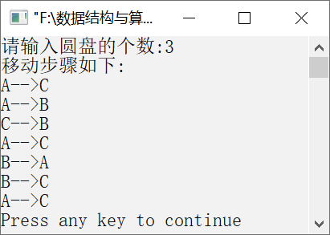

### 12.2.6　汉诺塔问题


**问题描述**


汉诺塔问题源于印度的一个古老传说。在该传说中，最初有3根柱子，在一根柱子上从下往上按从大到小的顺序摞着64个圆盘。要求把圆盘从下面开始按从大到小的顺序重新摆放在另一根柱子上。同时规定，在小圆盘上不能放大圆盘，在3根柱子之间一次只能移动1个圆盘。


**【分析】**

这个问题其实就是将n个圆盘从柱子A移动到柱子C上，在移动的过程中可以利用柱子B，每次只能移动1个圆盘，且始终保持大圆盘在下，小圆盘在上。

要把n个圆盘从柱子A借助柱子B移动到柱子C，要先把上面的（n−1）个圆盘从柱子A借助柱子C移动到柱子B，然后把第n个圆盘直接移到柱子C上，最后再把（n−1）个圆盘从柱子B借助柱子A移动到柱子C，这样就把规模为n的问题分解成规模为（n−1）的问题。

这样就可以实现将n个圆盘从柱子A移动到柱子C上了，但是还有一个问题没有解决。怎样才能将（n−1）个圆盘从柱子A移动到柱子B上，然后再从柱子B移动到柱子C上呢？

要把（n−1）个圆盘从柱子A移动到柱子B上，需要先将上面的（n−2）个圆盘借助柱子B从柱子A移动到柱子C上，然后将第（n−1）个圆盘直接移动到柱子B上，之后再借助柱子A将（n−2）个圆盘从柱子C移动到柱子B上。

要将（n−1）个圆盘从柱子B移动到柱子C还要借助递归实现。移动圆盘的过程正好符合递归的特点，即将规模较大的问题简化为规模较小的子问题。递归结束的条件就是一次只需要移动一个圆盘，否则递归继续进行下去。

为了使问题简化，我们分析一下将3个圆盘从柱子A借助柱子B移动到柱子C上的过程。

（1）将柱子A上的两个圆盘移动到柱子B上（借助柱子C）。

（2）将柱子A上的一个圆盘直接移动到柱子C上（A→C）。

（3）将柱子B上的两个圆盘移动到柱子C上（借助柱子A）。

其中，第（2）步可以直接实现，第（1）步可以继续分解为如下步骤。

① 将柱子A上的1个圆盘直接移动到柱子C上（A→C）。

② 将柱子A上的1个圆盘直接移动到柱子B上（A→B）。

③ 将柱子C上的1个圆盘直接移动到柱子B上（C→B）。

第（3）步可以继续分解为如下步骤。

① 将柱子B上的1个圆盘直接移动到柱子A上（B→A）。

② 将柱子B上的1个圆盘直接移动到柱子C上（B→C）。

③ 将柱子A上的1个圆盘直接移动到柱子C上（A→C）。

综上，移动3个圆盘的步骤如下。

A→C，A→B，C→B，A→C，B→A，B→C，A→C。


第12章\实例12-15.c

```c
/********************************************
*实例说明：汉诺塔问题
*********************************************/
1  #include<stdio.h>
2  void hanoi(int n,char one,char two,char three);
3  void move(char x,char y);
4  void main()
5  {
6      int n;
7      printf("请输入圆盘的个数:");
8      scanf("%d",&n);
9      printf("移动步骤如下:\n");
10     hanoi(n,'A','B','C');
11 }
12 void move(char x,char y)
13 {
14     printf("%c-->%c\n",x,y);
15 }
16 void hanoi(int n,char one ,char two,char three)
17 {
18     if(n==1)
19         move(one,three);
20     else
21     {
22         hanoi(n-1,one,three,two);
23         move(one,three);
24         hanoi(n-1,two,one,three);
25     }
26 }
```

运行结果如图12.19所示。


<center class="my_markdown"><b class="my_markdown">图12.19　运行结果</b></center>

**【说明】**

第18～19行中，当只有1个圆盘时，只需要将圆盘直接从第1个柱子移动到第3个柱子上即可。

第22行中，将（n−1）个圆盘借助第3个柱子从第1个柱子移动到第2个柱子上。

第23行中，将1个圆盘直接从第1个柱子移动到第3个柱子上。

第24行中，将（n−1）个圆盘借助第1个柱子从第2个柱子移动到第3个柱子上。

