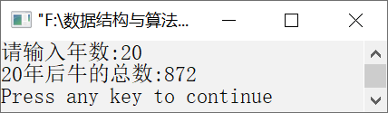

### 12.2.7　大牛生小牛问题


**问题描述**


1头刚出生的小牛，4年后生1头小牛，且以后每年生1头。现有1头刚出生的小牛，问20年后共有牛多少头？


**【分析】**

由题意可以看出，本题可以分为两种情况处理：小于4年时，只有1头小牛；大于或等于4年时，小牛成长为大牛，开始生小牛。递归函数的原型如下。

```c
long Cow(int years);
```

如果years<4，则返回1，表示只有1头牛；当years
4时，第4年的大牛开始生小牛，每年生1头牛。同时，每隔3年，小牛成长为大牛，开始生小牛。因此需要递归调用Cow函数。代码如下。

```c
1  i = 4;
2  while (i <= years)
3  {
4      subYears = i – 3;
5      count += Cow(subYears);
6      i++;
7  }
```


第12章\实例12-16.c

```c
/********************************************
*实例说明：大牛生小牛问题
*********************************************/
1  #include<stdio.h>
2  long Cow(int years);
3  void main()
4  {
5      long n;
6      int year;
7      printf("请输入年数:");
8      scanf("%d",&year);
9      n=Cow(year);
10     printf("%d年后牛的总数:%d\n",year,n);
11 }
12 long Cow(int years)
13 {
14     long count=1;
15     int i,subYears;
16     if (years<=3)
17     {
18         return 1;
19     }
20     i=4;
21     while (i<=years)
22     {
23          subYears =i–3;
24          count += Cow(subYears);
25          i++;
26     }
27     return count;
28 }
```

运行结果如图12.20所示。


<center class="my_markdown"><b class="my_markdown">图12.20　运行结果</b></center>

**【说明】**

第16～19行中，若小牛还不到生育年龄，返回1，即原来大牛的头数。

第20行从第4年开始逐年计算牛的头数。

第21～26行计算大牛和生的小牛的总头数。

第23行准备计算第4年的生的小牛头数。

第24行递归调用Cow函数计算大牛和生的小牛总头数。

